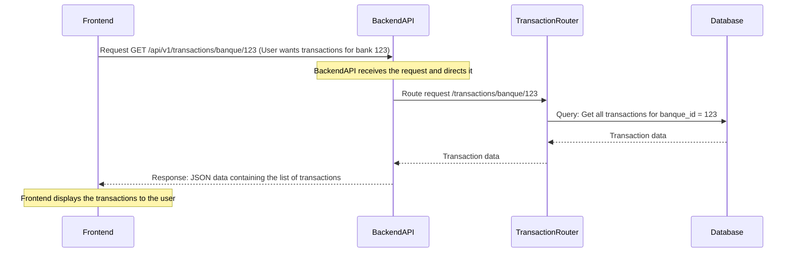

# Chapter 1: Backend API (Communication Hub)

Welcome to the first chapter of the Big Defend IA tutorial! We're going to start with the heart of the system: the **Backend API**. Think of it as the brain and the central communication point for our entire application.

### What is the Backend API?

Imagine our Big Defend IA project is like a busy bank that's trying to spot fraudulent transactions.

*   The **Frontend** is like the customer's mobile app or the teller's computer. This is what people *see* and *interact with*.
*   The **Backend** is like the bank's main office. This is where all the important work happens: managing accounts, checking balances, making decisions about whether a transaction is suspicious, and keeping records.

The **Backend API (Communication Hub)** is the special window or phone line that connects the customer's app (Frontend) to the main office (Backend). It's the way the Frontend can *ask* the Backend to do things (like "show me my transactions", "check if this is fraud") and the way the Backend *sends back* the answers (like "here are your transactions", "yes, this transaction looks suspicious").

Without this communication hub, the Frontend would just be a pretty screen with no data, and the Backend would be doing important work in the background that nobody could see or use.

### Our First Use Case: Seeing Your Transactions

Let's think about a simple task: **As a user, I want to see a list of my transactions in the Big Defend IA application.**

How does the application make this happen?

1.  The user is looking at the Frontend application (the web page or app).
2.  The Frontend needs the transaction data. But the data isn't stored *in* the Frontend. It's stored securely in a database managed by the **Backend**.
3.  So, the Frontend needs to *ask* the Backend for the data.
4.  The Backend receives the request, finds the data in the database, and sends it back to the Frontend.
5.  The Frontend receives the data and displays it nicely for the user.

This asking and answering process is handled by the **Backend API**.

### How the Frontend Talks to the Backend

The Frontend uses something called an **API Client** or **API Service** to make these requests. It knows the "addresses" (called **endpoints** or **routes**) on the Backend API to ask for specific information.

Let's look at a small part of the code in the Frontend that handles talking to the API:

```typescript
// --- File: bdia - FrontEND/src/services/apiService.ts ---
import axios from 'axios';

// This is the base address of our Backend API
const BASE_URL = 'http://localhost:8000/api/v1';

// We create an instance that knows where to send requests
const api = axios.create({
  baseURL: BASE_URL,
  headers: {
    'Content-Type': 'application/json',
  },
});

// ... other code for authentication and error handling ...

// This function is how the Frontend asks for transactions
export const getTransactions = async (banqueId: number) => {
  // We use the 'api' instance and ask it to do a GET request
  // to the specific address '/transactions/banque/{banqueId}'
  const res = await api.get(`/transactions/banque/${banqueId}`);
  // The Backend sends back data, which we return
  return res.data;
};

// ... other functions to talk to other API endpoints ...
```

This code snippet shows:

*   `BASE_URL`: The main web address where our Backend API is running.
*   `axios.create`: A tool (`axios`) that helps us make requests, configured to always go to our `BASE_URL`.
*   `getTransactions`: A function that the rest of the Frontend code can call when it needs transaction data.
*   `api.get(...)`: This is the actual command to send a "GET" request (meaning "please give me data") to a specific part of the Backend API's address book (`/transactions/banque/${banqueId}`). The `{banqueId}` part is a placeholder for the specific bank's ID we want transactions for.

When the Frontend calls `getTransactions(123)`, it's essentially sending a message to `http://localhost:8000/api/v1/transactions/banque/123` asking for the transactions for bank ID 123.

### How the Backend Receives and Processes Requests

Now, let's look at the Backend side. The Backend is constantly listening for incoming requests at its address (`http://localhost:8000`). When a request arrives at a specific endpoint (like `/transactions/banque/{banque_id}`), the Backend knows which piece of code should handle that request.

The main file in the Backend (`main.py`) sets up the overall API and tells it where to find the code that handles different types of requests.

```python
# --- File: bdia-BackEND/app/main.py ---
from fastapi import FastAPI

# ... other imports ...

# Create the main FastAPI application instance
app = FastAPI()

# Include routes for transactions.
# This tells the app that any request starting with '/transactions'
# should be handled by the code in the 'transactions' router.
from app.routers.transaction import router as transactions
app.include_router(transactions)

# Include routes for alerts.
# Requests starting with '/alerts' go to the 'alerts' router.
from app.routers import alerts
app.include_router(alerts.router)

# ... other setup like database connection and authentication routes ...

# Démarrage de l'application (Application startup) - This line is just for logging.
# logger.info("Démarrage de l'application")
```

This `main.py` file is like the bank's reception desk. It receives all incoming calls/requests and directs them to the right department. It sees a request for `/transactions/...` and says, "Ah, that goes to the Transaction Router!"

Let's look inside the `app/routers/transaction.py` file to see the specific code that handles our `get_transactions_by_banque` request:

```python
# --- File: bdia-BackEND/app/routers/transaction.py ---
from fastapi import APIRouter, Depends
from sqlalchemy.orm import Session # Used to talk to the database
from app.models.transaction import Transaction # Represents transaction data
from app.core.database import get_db # Function to get database connection
from app.schemas.transaction import TransactionRead # How the data should look when sent back
from app.logging.log_setup import logger # For logging messages

# This creates a router specifically for transaction-related endpoints
router = APIRouter(prefix="/transactions", tags=["Transactions"])

# This is the function that handles the GET request to /transactions/banque/{banque_id}
@router.get("/banque/{banque_id}", response_model=list[TransactionRead])
def get_transactions_by_banque(banque_id: int, db: Session = Depends(get_db)):
    # Use the database connection (db) to query for Transaction records
    # where the banque_id matches the one from the request.
    transactions_list = db.query(Transaction).filter(Transaction.banque_id == banque_id).all()
    
    # Return the found transactions. FastAPI automatically converts this
    # Python list into JSON data that the Frontend can understand.
    return transactions_list

# ... other functions for adding transactions, getting all transactions, etc.
```

This code is the "Transaction Department" in our bank analogy.

1.  `@router.get("/banque/{banque_id}", ...)`: This line tells FastAPI (our backend framework) that the function `get_transactions_by_banque` should run whenever it receives a GET request at the address `/transactions/banque/` followed by a number (the `banque_id`).
2.  `banque_id: int`: It automatically extracts the number from the address and provides it as the `banque_id` variable to the function.
3.  `db: Session = Depends(get_db)`: This gets a connection to the database. (We'll talk more about [Database Management](08_database_management_.md) in a later chapter).
4.  `db.query(...).filter(...).all()`: This is the command to the database saying "Find all Transaction records where the bank ID matches the one requested".
5.  `return transactions_list`: The list of transactions found is sent back as the response to the Frontend.

### The Communication Flow Visualized

Here's a simple diagram showing the steps for our "See Your Transactions" use case:



This diagram illustrates the core idea: the Frontend makes a request to a specific address on the Backend API, the Backend routes the request to the correct handler function, that function does the necessary work (like getting data from the database), and the Backend sends the result back to the Frontend.

### Beyond Transactions

The Backend API doesn't just handle transactions. It's the hub for *everything*:

*   Getting [Fraud Detection Core (AI Engine)](05_fraud_detection_core__ai_engine__.md) predictions.
*   Managing [Alert Management](06_alert_management_.md).
*   Handling [User and Role Management](03_user_and_role_management_.md) (like creating new users).
*   Managing [Authentication System](02_authentication_system_.md) (logging users in).
*   Providing overall dashboard data.
*   And much more!

Each of these functions corresponds to different **endpoints** on the API, handled by different parts of the Backend code (often organized into separate **routers** like `alerts.py` or `admin.py`).

### Conclusion

The **Backend API** is the central nervous system of our application. It receives requests from the Frontend (the user interface), processes them by interacting with the database or running complex logic (like our AI models), and sends back the necessary data. It's the essential link that allows the Frontend to be dynamic and display real-time, relevant information.

Now that we understand how the Frontend and Backend talk to each other via the API, the next crucial step is to ensure that only the *right* people can access sensitive information or perform certain actions. This brings us to the concept of proving who you are.

Let's move on to the next chapter to understand how the system handles identifying users.

[Authentication System](02_authentication_system_.md)