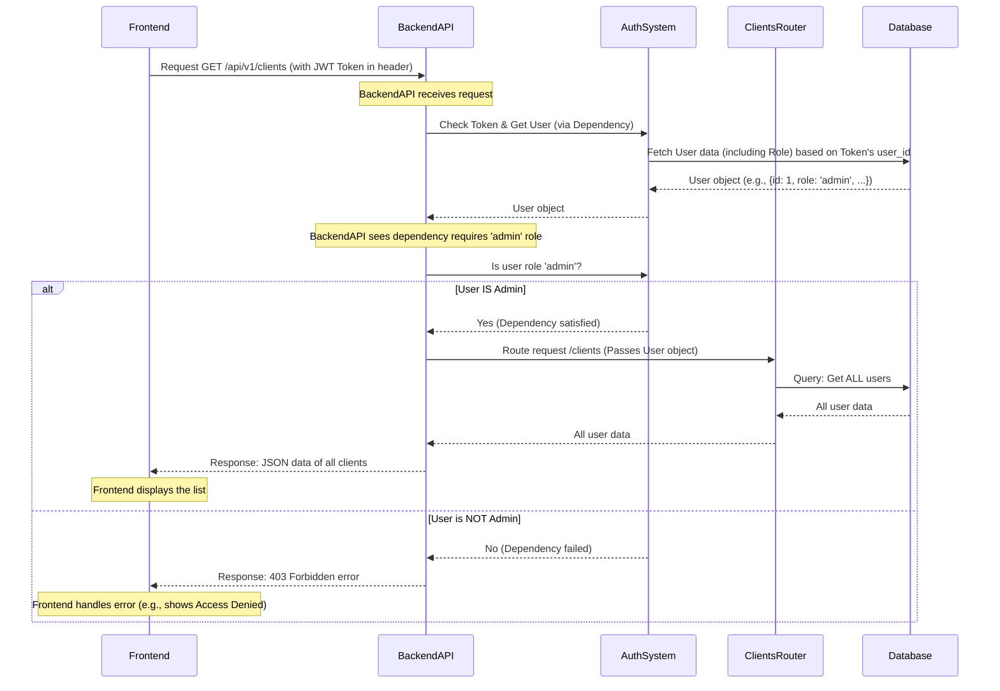

# Chapter 3: User and Role Management

Welcome back to the Big Defend IA tutorial! In the previous chapter, [Authentication System](02_authentication_system_.md), we learned how the system verifies *who* you are when you log in. You get a special pass (a JWT token) that proves your identity for future interactions.

Now that the system knows *who* you are, the next crucial question is: *What are you allowed to do?* Just like in our bank analogy, simply having an ID doesn't mean you can access every vault or see every customer's account details. Different people have different jobs and need different levels of access.

This is the job of **User and Role Management**. It defines different categories of users and controls their permissions within the application.

### What is User and Role Management?

Think of it this way:

*   **Users:** These are the individual accounts in the system (like "Admin BigDefend", "Analyste Fraude", "Client Protégé"). Each user has an identity verified by the [Authentication System](02_authentication_system_.md).
*   **Roles:** These are labels assigned to users that group permissions together. Instead of giving specific rights to each user individually, we say "Anyone with the 'Admin' role can do X, Y, Z." This makes managing permissions much easier. In Big Defend IA, our main roles are:
    *   `admin`: Has full access to manage users, view all data, configure settings, etc.
    *   `analyst`: Can view alerts, investigate transactions, but cannot manage users or change core settings.
    *   `client`: Can only view their own specific transactions and potentially their security status.
*   **Authorization:** This is the process of checking a user's role (or specific permissions) to decide if they are *authorized* to perform a requested action or access specific data. This happens *after* the user has been *authenticated*.

| Concept        | Analogy                                 | What it answers             | Covered in Chapter...     |
| :------------- | :-------------------------------------- | :-------------------------- | :------------------------ |
| **Authentication** | Checking your ID at the entrance      | *Who are you?* (Prove it!)  | [Authentication System](02_authentication_system_.md) |
| **Authorization**  | What areas your ID allows you to access | *What can you do?*          | **This chapter**          |

This chapter focuses on **Authorization** driven by **Roles**.

### Our Use Case: Seeing Only What You're Allowed To

Let's consider this core task: **Ensure that a 'client' user can only see their own transactions, while an 'admin' user can see all transactions and manage other users.**

How does Big Defend IA use roles to achieve this? It involves checks on both the Frontend and, more importantly, the Backend.

### Frontend Role-Based Display (User Experience)

The Frontend application uses the user's role (which it gets during the login process from the [Authentication System](02_authentication_system_.md) and stores in the `AuthContext`) to decide *what to show* to the user. This improves the user experience by hiding options that aren't available, but it's **not** the primary security measure.

Look at the `Sidebar.tsx` file:

```typescript
// --- File: bdia - FrontEND/src/components/Layout/Sidebar.tsx (Simplified) ---
import { useAuth } from '../../contexts/AuthContext';
// ... other imports ...

const Sidebar: React.FC = () => {
  const { user } = useAuth(); // Get the logged-in user from the AuthContext

  const getNavigationItems = () => {
    const baseItems = [
      { to: '/dashboard', icon: LayoutDashboard, label: 'Dashboard' },
    ];

    switch (user?.role) { // Check the user's role
      case 'admin':
        return [
          ...baseItems,
          { to: '/alerts', label: 'Alertes IA' }, // Admin sees Alerts
          { to: '/transactions', label: 'Transactions' }, // Admin sees all Transactions
          { to: '/clients', label: 'Clients' }, // Admin sees Clients management
        ];
      case 'analyst':
        return [
          ...baseItems,
          { to: '/alerts', label: 'Alertes IA' }, // Analyst sees Alerts
          { to: '/transactions', label: 'Transactions' }, // Analyst sees all Transactions (usually)
        ];
      case 'client':
        return [
          ...baseItems,
          { to: '/my-transactions', label: 'Mes Transactions' }, // Client sees ONLY 'My Transactions'
        ];
      default:
        return baseItems; // Default for unauthenticated or unknown role
    }
  };

  const navigationItems = getNavigationItems();

  return (
    <div className="..."> {/* Sidebar container */}
      {/* ... Logo ... */}
      <nav className="space-y-2">
        {navigationItems.map((item) => (
          <NavLink key={item.to} to={item.to} className="...">
            {/* ... Icon and Label ... */}
          </NavLink>
        ))}
      </nav>
      {/* ... IA Status ... */}
    </div>
  );
};

export default Sidebar;
```

This code checks `user?.role` and changes which navigation links appear in the sidebar. An admin sees links for "Clients", "Transactions", and "Alerts", while a client only sees "Mes Transactions". This is a basic example of role-based display.

Similarly, look at the `ClientsPage.tsx`:

```typescript
// --- File: bdia - FrontEND/src/pages/ClientsPage.tsx (Simplified) ---
import React, { useState, useEffect } from 'react';
import { useAuth } from '../contexts/AuthContext';
// ... other imports and interface definition ...

const ClientsPage: React.FC = () => {
  const { user } = useAuth(); // Get the logged-in user
  // ... state and effects for fetching clients ...

  // --- Role check ---
  if (user?.role !== 'admin') { // If the user is NOT an admin...
    return (
      <div className="p-8 text-center">
        <Shield className="mx-auto h-12 w-12 text-red-500" />
        <h2 className="mt-4 text-xl font-bold">Accès refusé</h2>
        <p className="mt-2 text-gray-600">
          Vous n'avez pas les permissions nécessaires pour accéder à cette page.
        </p>
      </div>
    );
  }
  // --- End Role check ---

  // ... rest of the Admin-only page content (fetching and displaying clients) ...

  return (
    <div className="p-6">
      {/* ... Page title and "Add Client" button (only shown if the component renders) */}
      {/* ... Clients Table (only shown if the component renders) */}
      {/* ... Add Client Modal (only shown if the component renders) */}
    </div>
  );
};

export default ClientsPage;
```

Here, the entire content of the `ClientsPage` component is wrapped in a check: `if (user?.role !== 'admin')`. If the user is not an admin, it simply renders a "Access Denied" message instead of the client list and management tools.

These Frontend examples are helpful, but they are *only* about preventing users from *seeing* options or pages. A clever user could potentially bypass these Frontend checks (e.g., using browser developer tools) and still try to access the Backend API endpoints directly. This is why the **real security check** must happen on the Backend.

### Backend Role-Based Authorization (The Real Security)

The Backend API must be the ultimate gatekeeper. When it receives a request from the Frontend, it first uses the [Authentication System](02_authentication_system_.md) to identify the user (via the JWT token). *Then*, before performing the requested action (like fetching data or creating a user), it checks if that authenticated user has the required role(s).

Our Backend, built with FastAPI and `fastapi-users`, makes this quite easy using **Dependencies**. A dependency is a function that runs automatically before a route handler. `fastapi-users` provides dependencies like `current_user` that not only get the authenticated user but can also check their roles.

Let's look at how a hypothetical Backend endpoint (like the one the Frontend's `ClientsPage` might call, though in our project it maps to the `/users` endpoint provided by `fastapi-users` for user management) would be protected:

```python
# --- Example: Simplified Backend Endpoint with Role Check ---
from fastapi import APIRouter, Depends, HTTPException, status
from sqlalchemy.orm import Session
# Assume we have a way to get the authenticated user object
# from fastapi_users after authentication check.
# This is provided by fastapi_users.current_user dependency.
from app.models.user import User # Our User model with the 'role' field
from app.core.database import get_db
from app.auth.user_manager import fastapi_users # The fastapi_users instance from main.py

# Assume this router is included in main.py with prefix "/clients" or "/users"
router = APIRouter(prefix="/clients", tags=["Clients"])

# Define a dependency that requires the user to be authenticated AND have the 'admin' role
# This is the core authorization mechanism
async def get_current_active_admin(current_user: User = Depends(fastapi_users.current_user())):
    # fastapi_users.current_user() already checks if the token is valid
    if current_user.role != 'admin': # Now, we manually check the role
        # If the user is NOT an admin, raise an HTTP exception (403 Forbidden)
        raise HTTPException(
            status_code=status.HTTP_403_FORBIDDEN,
            detail="Not enough permissions",
        )
    return current_user # If they are admin, return the user object (dependency is satisfied)

# This is an endpoint to get the list of all users/clients
# It USES the get_current_active_admin dependency
@router.get("/") # Example endpoint: GET /clients
def read_clients(
    # This line makes sure get_current_active_admin runs BEFORE this function
    admin_user: User = Depends(get_current_active_admin),
    db: Session = Depends(get_db)
):
    # If we reach this line, we KNOW the user is authenticated AND is an admin
    # Now we can safely fetch ALL users from the database
    clients_list = db.query(User).all()
    return clients_list

# --- Example: Simplified Backend Endpoint for a Client's OWN data ---
# This dependency requires authentication but allows any role
async def get_current_active_user(current_user: User = Depends(fastapi_users.current_user())):
     return current_user # No role check here, just need to be logged in

@router.get("/my-transactions/{user_id}") # Example: GET /my-transactions/4 (for client user with ID 4)
def read_my_transactions(
    # This dependency gets the authenticated user
    current_user: User = Depends(get_current_active_user),
    db: Session = Depends(get_db)
):
    # In a real app, this endpoint would fetch transactions
    # BUT it MUST filter them based on the current_user's ID!
    # It would NOT use the {user_id} from the path unless it's for an admin viewing another user's data.
    # A client should only ever see THEIR OWN transactions.
    
    # Correct logic for a client: Fetch transactions for current_user.id
    user_transactions = db.query(Transaction).filter(Transaction.user_id == current_user.id).all()
    
    # In a simplified example, just show who accessed it:
    print(f"User {current_user.id} ({current_user.role}) accessed their own transactions.")
    # return user_transactions # Return the filtered transactions

# NOTE: The actual `/transactions` endpoint in the project uses `banque_id`.
# A more robust system would link users to banques and filter transactions accordingly.
# The key concept here is using the `current_user` object to FILTER data.
```

In this simplified Backend example:

1.  `get_current_active_admin`: This is a custom dependency. It first uses the standard `fastapi_users.current_user()` dependency to ensure there is a valid authenticated user. Then, it explicitly checks if that user's `role` attribute is equal to `'admin'`. If not, it stops the request immediately by raising a 403 Forbidden error.
2.  `read_clients`: This route for getting all clients lists `admin_user: User = Depends(get_current_active_admin)` as one of its parameters. This tells FastAPI to *run* `get_current_active_admin` before running `read_clients`. If `get_current_active_admin` raises an error (because the user isn't an admin), `read_clients` is never called. If it succeeds, `read_clients` gets the `admin_user` object and proceeds to fetch all users/clients.
3.  `read_my_transactions`: This endpoint uses `get_current_active_user` which just checks if the user is logged in, regardless of role. *Crucially*, the code *inside* this function then uses `current_user.id` to filter the transactions fetched from the database, ensuring the user only sees their own data. This is **row-level security** combined with role-based access.

This Backend-side check is the essential security layer. Even if a non-admin user somehow tricks the Frontend into trying to request the `/clients` list, the Backend will receive the request, check their token, see their role isn't 'admin', and return a 403 error before any sensitive data is exposed.

### How it Works Under the Hood

1.  **User Model:** The core of the system is the `User` model in the database (`app/models/user.py`). This model includes a `role` field, which stores the user's assigned role ('admin', 'analyst', 'client', etc.).

    ```python
    # --- File: bdia-BackEND/app/models/user.py (Simplified) ---
    from sqlalchemy import Column, Integer, String, Boolean
    from app.models.base import Base
    from fastapi_users_db_sqlalchemy import SQLAlchemyBaseUserTable

    class User(SQLAlchemyBaseUserTable[int], Base):
        __tablename__ = "users"
        id = Column(Integer, primary_key=True, index=True)
        # ... other fastapi-users fields (email, password, etc.) ...

        # Custom field to store the user's role
        role = Column(String, default="client") # Default role is 'client'
        # ... other custom fields (nom) ...
    ```
    When a user is created, their role is stored here.

2.  **Authentication Provides User Object:** When a user successfully authenticates (Chapter 2), the `fastapi-users` library loads their `User` object from the database. This object includes their `id`, `email`, `nom`, and most importantly, their `role`.
3.  **JWT Token (Implicitly):** While the JWT token itself doesn't typically store the *full* user object, it contains the user's ID. The `fastapi-users.current_user` dependency uses this ID to quickly fetch the up-to-date `User` object from the database (or cache) for every protected request.
4.  **Backend Dependencies Check Role:** As shown in the example above, Backend routes needing authorization include a `Depends(...)` that checks the `role` attribute of the fetched `User` object. This check happens automatically by FastAPI before the main function logic runs.

### The Flow with Authorization

Here's how a request for protected data (like the list of all clients) flows, including the authorization step:



This diagram shows that the role check is an integral part of processing a request to a protected endpoint on the Backend.

### Conclusion

**User and Role Management** is essential for controlling access and ensuring security in the Big Defend IA application. By assigning specific **Roles** (Admin, Analyst, Client) to **Users**, the system can implement **Authorization** checks on the Backend API. These checks, often facilitated by framework features like FastAPI's dependencies, ensure that users can only access the data and features appropriate for their role, preventing unauthorized actions and protecting sensitive information. While the Frontend uses roles to improve the user interface, the Backend provides the critical security layer by enforcing permissions before processing requests.

Now that we understand how users are identified, authenticated, and authorized based on their roles, let's shift our focus to how the information is presented to these different users in the interface.

Let's move on to the next chapter to understand the overall structure of the Frontend application.

[Frontend Application Structure](04_frontend_application_structure_.md)