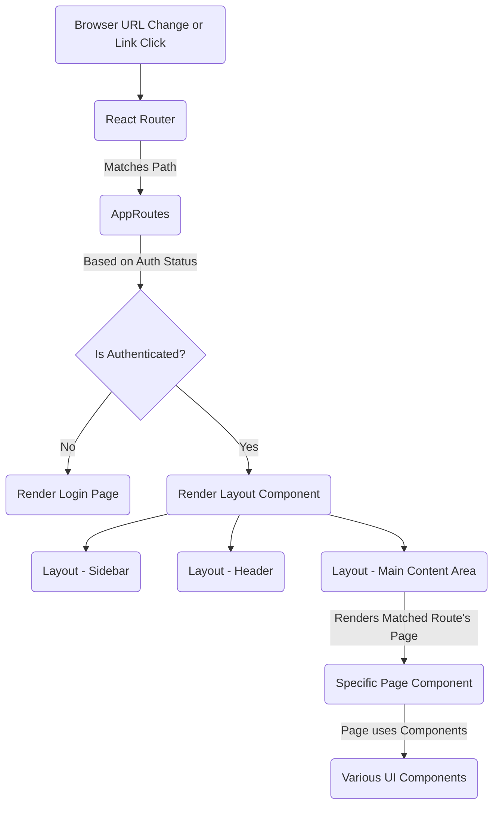

# Chapter 4: Frontend Application Structure

Welcome back to the Big Defend IA tutorial! In the last chapter, [User and Role Management](03_user_and_role_management_.md), we explored how our system identifies users and determines what they are allowed to do based on their roles. This is crucial for security and access control on the **Backend**.

Now, let's shift our focus to the part of the application you actually *see* and *interact with*: the **Frontend**. This is where the user interface (UI) lives – the dashboards, forms, tables, and pages that make up the Big Defend IA application.

### What is the Frontend?

Imagine you're using a complex machine with a lot of dials, screens, and buttons. The **Frontend** is that control panel and all the displays. It takes the information and capabilities provided by the **Backend API** (our communication hub from [Backend API (Communication Hub)](01_backend_api__communication_hub__.md)) and presents them to the user in a way that is easy to understand and interact with.

For Big Defend IA, our Frontend is built using **React**, a popular JavaScript library for building user interfaces. React helps us manage the complexity of the UI by breaking it down into smaller, manageable pieces.

### The Challenge: Organizing a Complex UI

A real-world application like Big Defend IA has many different screens: a login page, a main dashboard, a list of alerts, a list of transactions, a page to manage users, and more. Each of these screens has various elements (buttons, tables, charts, forms) that might be reused in different places.

How do we build this complex system without everything becoming a tangled mess?

This is where **Frontend Application Structure** comes in. It's about organizing the code in a logical way so it's easier to build, understand, maintain, and scale.

### Core Concepts: Components, Pages, and Routing

The structure of our React Frontend revolves around three key concepts:

1.  **Components:** Think of these as the basic building blocks or LEGO bricks of our UI. A component is a small, independent, and reusable piece of UI (like a button, a text input, a user profile card, or even a whole section of a page). We build complex UIs by combining many simple components.
2.  **Pages:** These are the top-level components that represent an entire screen or view in the application (like the `Login` page, `Dashboard` page, or `Alerts` page). Pages are typically assembled by combining several smaller components.
3.  **Routing:** This is the system that manages navigation between different **Pages**. When you click a link in the sidebar or type a specific address (URL) in your browser, the **Routing** system determines which **Page** should be displayed.

### Our Use Case: Navigating the Application Based on Role

Let's tie this back to our previous chapter on [User and Role Management](03_user_and_role_management_.md). Our use case is: **As a logged-in user, I want to easily navigate to the different sections of the application that my role allows me to access.**

For example:
*   An `admin` should see and be able to navigate to the Dashboard, Alerts, Transactions, and Clients pages.
*   A `client` should only see and be able to navigate to the Dashboard and their "My Transactions" page.

The Frontend structure, particularly the routing system and component organization, is what makes this role-based navigation and display possible on the UI side.

### How the Frontend Handles Structure and Navigation

Our Big Defend IA Frontend uses the `react-router-dom` library to manage **Routing**.

The central place where routing is configured is typically the main `App.tsx` file:

```typescript
// --- File: bdia - FrontEND/src/App.tsx (Simplified) ---
import React from 'react';
import { BrowserRouter as Router, Routes, Route, Navigate } from 'react-router-dom';
import { AuthProvider, useAuth } from './contexts/AuthContext';

// Import Page components
import Login from './pages/Login';
import Dashboard from './pages/Dashboard';
import Alerts from './pages/Alerts';
import ClientsPage from './pages/ClientsPage';
import Layout from './components/Layout/Layout'; // The main layout component

// Component that defines all our routes
const AppRoutes: React.FC = () => {
  const { isAuthenticated, loading } = useAuth(); // Check auth status from context

  // ... loading state handling ...

  // If not authenticated, ONLY allow access to login page
  if (!isAuthenticated) {
    return (
      <Routes>
        <Route path="/login" element={<Login />} />
        {/* Redirect any other path to login */}
        <Route path="*" element={<Navigate to="/login" />} />
      </Routes>
    );
  }

  // If authenticated, define the main application routes
  return (
    <Routes>
      {/* If already logged in, redirect login to dashboard */}
      <Route path="/login" element={<Navigate to="/dashboard" />} />
      
      {/* The Layout component wraps routes that share a common structure (sidebar, header) */}
      <Route path="/" element={<Layout />}>
        {/* Index route for the layout, redirects to dashboard */}
        <Route index element={<Navigate to="/dashboard" />} />
        
        {/* Define routes for different pages */}
        <Route path="dashboard" element={<Dashboard />} />
        <Route path="alerts" element={<Alerts />} />
        <Route path="transactions" element={<div className="p-6">Transactions Page (Details in later chapter)</div>} />
        <Route path="clients" element={<ClientsPage />} />
        <Route path="my-transactions" element={<div className="p-6">My Transactions Page (Details in later chapter)</div>} />

        {/* ... other potential routes (analytics, models, settings) ... */}
      </Route>

      {/* Catch-all for unknown paths after login */}
       <Route path="*" element={<Navigate to="/dashboard" />} /> 
    </Routes>
  );
};

// The root App component sets up the Router and AuthProvider
function App() {
  return (
    <AuthProvider> {/* Provides authentication status to all components */}
      <Router> {/* Enables routing */}
        <div className="min-h-screen bg-slate-50">
          <AppRoutes /> {/* Renders the specific routes based on auth status */}
        </div>
      </Router>
    </AuthProvider>
  );
}

export default App;
```

Let's break down the key parts:

*   `BrowserRouter as Router`: This sets up the routing mechanism using the browser's history API (so the URL changes without a full page reload).
*   `AuthProvider`: This wraps the entire application to make the user's authentication status and details (including their role) available anywhere using the `useAuth` hook (as seen in Chapter 2 and 3).
*   `AppRoutes`: This component contains the core routing logic. It uses the `isAuthenticated` status from `useAuth` to decide which set of routes to make available. If not logged in, you only see the `/login` route. If logged in, you get access to the main app routes.
*   `Routes`: This component from `react-router-dom` acts like a container for individual route definitions.
*   `Route`: Each `<Route>` component maps a specific URL `path` (like `/login` or `/dashboard`) to a specific React `element` (our **Page** components like `<Login />` or `<Dashboard />`).
*   `<Navigate to="/login" />`: This is used to automatically redirect the user to a different path, like sending them to the login page if they try to access a protected route while logged out.
*   `<Route path="/" element={<Layout />}>`: This is a nested route. It means that any path starting with `/` will render the `Layout` component. The `Layout` component itself contains an `<Outlet />` where the *nested* routes (`dashboard`, `alerts`, `clients`, etc.) will be rendered.

### The Layout Component

Many pages in our application share a common structure: a sidebar navigation on the left and a header/main content area on the right. Instead of repeating the code for the sidebar and header on every page component, we use a **Layout Component**:

```typescript
// --- File: bdia - FrontEND/src/components/Layout/Layout.tsx ---
import React from 'react';
import { Outlet } from 'react-router-dom';
import Sidebar from './Sidebar'; // Import the Sidebar component
import Header from './Header'; // Import the Header component

const Layout: React.FC = () => {
  return (
    <div className="flex h-screen bg-slate-50">
      <Sidebar /> {/* The persistent sidebar */}
      <div className="flex-1 flex flex-col overflow-hidden">
        <Header /> {/* The persistent header */}
        <main className="flex-1 overflow-auto p-6">
          <Outlet /> {/* This is where the specific PAGE component (Dashboard, Alerts, etc.) is rendered */}
        </main>
      </div>
    </div>
  );
};

export default Layout;
```

When you are on `/dashboard`, the `AppRoutes` renders `<Layout />`. Inside `Layout`, the `<Outlet />` is replaced by the `<Dashboard />` component. When you navigate to `/alerts`, the `<Outlet />` is replaced by the `<Alerts />` component, while the `Sidebar` and `Header` remain in place. This is a common pattern for organizing application structure.

### Role-Based Display in Components

As we saw in Chapter 3, the Frontend uses the user's role to decide what to *display*. A key place this happens is in the `Sidebar` component, determining which navigation links are visible:

```typescript
// --- File: bdia - FrontEND/src/components/Layout/Sidebar.tsx (Simplified) ---
import React from 'react';
import { NavLink } from 'react-router-dom';
import { useAuth } from '../../contexts/AuthContext'; // Get user context
import { LayoutDashboard, AlertTriangle, Users, CreditCard } from 'lucide-react'; // Icon components

const Sidebar: React.FC = () => {
  const { user } = useAuth(); // Get the logged-in user object (including role)

  const getNavigationItems = () => {
    const baseItems = [
      { to: '/dashboard', icon: LayoutDashboard, label: 'Dashboard' },
    ];

    switch (user?.role) { // Check the user's role to build the specific menu
      case 'admin':
        return [
          ...baseItems,
          { to: '/alerts', icon: AlertTriangle, label: 'Alertes IA' },
          { to: '/transactions', icon: CreditCard, label: 'Transactions' },
          { to: '/clients', icon: Users, label: 'Clients' },
        ];
      case 'analyst':
        return [
          ...baseItems,
          { to: '/alerts', icon: AlertTriangle, label: 'Alertes IA' },
          { to: '/transactions', icon: CreditCard, label: 'Transactions' },
        ];
      case 'client':
        return [
          ...baseItems,
          { to: '/my-transactions', icon: CreditCard, label: 'Mes Transactions' },
        ];
      default:
        return baseItems; // Show only base items for unknown roles
    }
  };

  const navigationItems = getNavigationItems(); // Get the list of items for the current user's role

  return (
    <div className="..."> {/* Sidebar container styles */}
      {/* ... Logo ... */}
      <nav className="space-y-2">
        {/* Map through the items allowed for this role and create navigation links */}
        {navigationItems.map((item) => (
          <NavLink key={item.to} to={item.to} className="...">
            {/* ... Icon and Label ... */}
          </NavLink>
        ))}
      </nav>
      {/* ... IA Status section ... */}
    </div>
  );
};

export default Sidebar;
```
This example shows how `useAuth()` is used to get the `user` object. Based on the `user.role`, the `getNavigationItems` function returns a different array of links. The sidebar then renders only the `<NavLink>` components for the paths in that array. This effectively hides menu items that a user isn't supposed to see according to their role.

Remember from Chapter 3: **This Frontend logic only controls *what is displayed* to the user. The real security check (Authorization) happens on the Backend when the user tries to access a specific API endpoint.** For instance, even if a 'client' user somehow manually types `/clients` in the URL, the Backend `/clients` endpoint is protected and will return a 403 Forbidden error because their token identifies them as a 'client', not an 'admin'.

### File Structure

The Frontend code is organized into logical folders to keep things tidy:

```
bdia - FrontEND/src/
├── App.tsx             # Main application setup and routing
├── index.tsx           # Entry point for the React application
├── components/         # Reusable UI pieces (buttons, cards, forms, layout elements)
│   ├── Layout/         # Components defining the overall page structure (Sidebar, Header, Layout)
│   └── Dashboard/      # Smaller components used within the Dashboard page (StatCard, Charts, etc.)
├── contexts/           # React Contexts for global state (like AuthContext)
├── hooks/              # Custom React hooks (like useDataset)
├── pages/              # Top-level components representing distinct screens (Login, Dashboard, Alerts, ClientsPage)
├── services/           # Code for interacting with the Backend API (apiService.ts)
├── types/              # TypeScript type definitions
├── utils/              # Utility functions
└── ... other files ...
```

*   `pages/`: This folder holds our **Pages** (`Login.tsx`, `Dashboard.tsx`, `Alerts.tsx`, `ClientsPage.tsx`). Each file here represents a full-screen view the user can navigate to via **Routing**.
*   `components/`: This folder contains smaller, reusable **Components**. `components/Layout/` specifically holds the structural components like `Sidebar.tsx` and `Layout.tsx`. Other folders inside `components/` might group components used in specific areas (like `components/Dashboard/` for dashboard widgets) or general-purpose components (like buttons, modals).
*   `services/`: As seen in Chapter 1, this is where the logic for talking to the Backend API lives (`apiService.ts`). Pages and Components use functions from here to fetch or send data.
*   `contexts/`: This is where global state is managed. `AuthContext.tsx` (from Chapter 2) is a key example, making the logged-in user's info available throughout the app.
*   `hooks/`: Contains custom React hooks, which are functions that let you reuse stateful logic. `useDataset` is an example used in `Dashboard` and `Alerts` to fetch and manage data display.

### Flow Visualized

Here's a simplified look at how routing and layout work together:



This diagram shows that the router is the entry point. Based on authentication, it either shows the login page or the main application `Layout`. The `Layout` provides the consistent framing, and the specific requested **Page** is rendered inside the main content area. These **Pages** are built using smaller **Components**.

### Conclusion

The **Frontend Application Structure** provides the visual interface and navigation system for Big Defend IA. By organizing the UI into reusable **Components**, assembling them into distinct **Pages**, and managing navigation between these pages with **Routing**, the project creates a user-friendly and maintainable application. The structure also integrates with the [Authentication System](02_authentication_system_.md) and [User and Role Management](03_user_and_role_management_.md) to dynamically display relevant content and navigation options based on the user's role.

Now that we understand the structure that presents the information, let's look at the core intelligence behind Big Defend IA: the AI Engine that actually detects the fraud.

[Fraud Detection Core (AI Engine)](05_fraud_detection_core__ai_engine__.md)