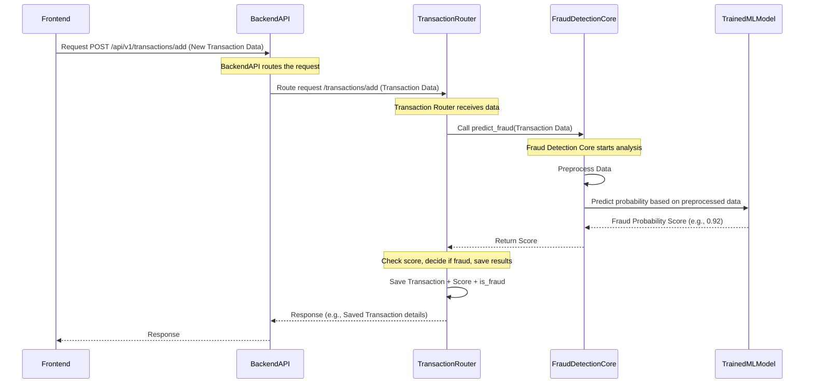

# Chapter 5: Fraud Detection Core (AI Engine)

Welcome back to the Big Defend IA tutorial! In the last chapter, [Frontend Application Structure](04_frontend_application_structure_.md), we explored how the user interface is built and organized to display information and allow users to interact with the system. But where does all the crucial information, especially about potential fraud, actually *come from*?

This is where the true intelligence of our system resides: the **Fraud Detection Core (AI Engine)**.

### What is the Fraud Detection Core (AI Engine)?

Imagine Big Defend IA is a security system for our bank. The [Backend API (Communication Hub)](01_backend_api__communication_hub__.md) is the central office, the [Authentication System](02_authentication_system_.md) and [User and Role Management](03_user_and_role_management_.md) are the security guards checking IDs and access levels, and the [Frontend Application Structure](04_frontend_application_structure_.md) is the dashboard and screens the security team sees.

The **Fraud Detection Core** is the expert fraud analyst sitting in that central office. This analyst has studied thousands of past transactions, learning to spot suspicious patterns and anomalies that a normal transaction wouldn't have. When a new transaction comes in, the analyst quickly reviews it, comparing it to everything they've learned, and decides how likely it is to be fraudulent.

In our project, this "expert analyst" is powered by **Machine Learning (ML) models**. These are complex programs trained on lots of data to recognize patterns.

### Our Use Case: Automatically Spotting Suspicious Transactions

The core job of Big Defend IA is to find fraud quickly. Our main use case for this chapter is: **As a new transaction is processed by the system, the Fraud Detection Core should analyze it and automatically identify if it is potentially fraudulent.**

How does the system make this crucial decision using its AI Engine?

### Key Concepts: Trained Models and Prediction

The magic of the Fraud Detection Core lies in a few key ideas:

1.  **Trained Models:** Think of the ML models (like XGBoost or Isolation Forest mentioned in the project description) as the analyst's brain, full of learned patterns. These models aren't created instantly; they are built through a separate process called **training** using historical data. This training usually happens offline, perhaps in a specialized tool or environment like a Jupyter Notebook. The result of this training is a "saved" model file.
2.  **Prediction:** Once a model is trained and saved, the Fraud Detection Core can use it to make a **prediction** on *new*, unseen data (a new transaction). The model takes the transaction details and outputs a score or probability indicating how likely it is to be fraudulent, based on the patterns it learned during training.
3.  **Preprocessing:** The raw data about a new transaction often isn't in the exact format the trained model expects. **Preprocessing** involves cleaning and transforming the data (e.g., extracting specific numbers or features, scaling values) so the model can understand and use it.

### How the Fraud Detection Core Works (Behind the Scenes)

When a new transaction is added to the system (likely via an API endpoint handled by the [Backend API (Communication Hub)](01_backend_api__communication_hub__.md)), the Backend needs to send it to the Fraud Detection Core for analysis.

Let's look at the simplified steps the system takes:

1.  A new transaction arrives at the Backend API.
2.  The Backend code tasked with handling new transactions receives the data.
3.  This code calls the **Fraud Detection Core** service, passing the transaction details.
4.  Inside the Fraud Detection Core, the transaction details are **preprocessed** to extract and format the necessary features.
5.  The **trained ML model(s)** are loaded (if not already in memory).
6.  The preprocessed features are fed into the **trained model(s)**.
7.  The model performs its analysis and returns a **fraud probability score** (a number, often between 0 and 1, where higher means more likely fraud).
8.  The Fraud Detection Core service returns this score back to the Backend code that called it.
9.  The Backend code checks if the score is above a certain threshold (e.g., > 0.8).
10. If the score is high, the transaction is flagged as potentially fraudulent (`is_fraud` is set to True), and an [Alert Management](06_alert_management_.md) process might be triggered (more on that in the next chapter!). The score is also saved with the transaction.

Here's a simple diagram illustrating this flow for adding and analyzing a new transaction:



This shows how the AI Engine is a service that the Backend calls to get an expert opinion on a new transaction.

### Where the Magic Happens: Code Snippets

Let's look at the simplified code that makes this work in the Backend.

First, the `app/services/fraud_detection.py` file. This file contains the core logic for loading the model and making predictions:

```python
# --- File: bdia-BackEND/app/services/fraud_detection.py (Simplified) ---
import joblib # Library to load saved models
import numpy as np
from app.models.schemas import TransactionInput # Schema for transaction data format
# from app.logging.log_setup import logger # For logging (omitted for simplicity)

# --- Loading the trained model and scaler ---
# These files are created during the separate training process
try:
    # This assumes the model files are in the 'app/ml_models' directory
    model = joblib.load("app/ml_models/fraud_detector.pkl")
    scaler = joblib.load("app/ml_models/scaler.pkl")
    print("✅ Modèle et scaler de détection de fraude chargés.")
except FileNotFoundError:
    print("❌ Fichiers modèle (fraud_detector.pkl ou scaler.pkl) non trouvés!")
    print("Génération d'un modèle factice pour permettre au service de démarrer.")
    # If models aren't trained yet, create a dummy model to avoid errors
    from app.services.mock_trainer import create_fake_model
    create_fake_model()
    # Try loading again after creating the fake model
    try:
        model = joblib.load("app/ml_models/fraud_detector.pkl")
        scaler = joblib.load("app/ml_models/scaler.pkl")
        print("✅ Modèle factice chargé.")
    except Exception as e:
         print(f"❌ Erreur critique: Impossible de charger le modèle même factice: {e}")
         # In a real app, you might raise an error or have a fallback
         model = None
         scaler = None


# --- Function to preprocess the transaction data ---
# This is a simplified example matching the mock trainer's features
# In a real model, this would be more complex
FEATURE_COLUMNS = ["transaction_amount", "hour"] # Example features used by the mock model

def preprocess_transaction(transaction: TransactionInput) -> np.ndarray:
    """Extracts and prepares features for the model."""
    if model is None or scaler is None:
        raise RuntimeError("Modèle ou scaler non chargé. Le service de détection est inactif.")

    # Safely get values, handling potential missing data or types
    amount = getattr(transaction, "transaction_amount", 0.0)
    # Extract hour from timestamp, handle if timestamp is missing or not datetime
    hour = 0
    if hasattr(transaction, "timestamp") and isinstance(transaction.timestamp, datetime):
         try:
            hour = transaction.timestamp.hour
         except AttributeError:
            pass # timestamp might be None or in unexpected format

    # Create a numpy array in the format expected by the loaded model
    features = np.array([[amount, hour]])
    return features

# --- The main prediction function ---
def predict_fraud(transaction_dict: dict) -> float:
    """Analyzes transaction data and returns fraud probability."""
    if model is None or scaler is None:
        # If models failed to load, return a default (e.g., low) score or raise error
        print("Modèle non disponible, renvoi d'une probabilité de fraude par défaut (0.0).")
        return 0.0
        
    try:
        # Convert input dict to the Pydantic schema for validation
        transaction_input = TransactionInput(**transaction_dict)

        # Preprocess the validated data
        features = preprocess_transaction(transaction_input)

        # Scale the features using the loaded scaler
        scaled_features = scaler.transform(features)

        # Get the fraud probability from the model
        # predict_proba returns [[prob_class_0, prob_class_1]]
        prob_fraud = model.predict_proba(scaled_features)[0][1]

        return float(prob_fraud) # Return the probability for the 'fraud' class (class 1)

    except Exception as e:
        # Log or handle any errors during prediction
        print(f"Erreur pendant la prédiction de fraude: {str(e)}")
        # In a real system, you might raise an error, return a default,
        # or flag for manual review depending on the error type.
        return 0.0 # Return default score on error

```

**Explanation:**

*   `joblib.load`: This is used to load the saved `.pkl` files that contain the trained ML model and the scaler (which is used to standardize the input data, a common step in ML).
*   `try...except FileNotFoundError`: This is a crucial part for beginners! It handles the case where the model files *don't exist* yet (because the training hasn't happened). It calls a `create_fake_model` function to put placeholder files there, so the application can still start without immediately crashing.
*   `preprocess_transaction`: This function takes the transaction data, extracts the specific pieces of information (`transaction_amount`, `timestamp` to get the `hour`) that the model was trained on (in this simplified example), and puts them into the right format (a NumPy array).
*   `predict_fraud`: This is the main function called by the API. It takes the transaction data (as a dictionary), converts it to our expected format (`TransactionInput` schema), preprocesses it, scales it, and then uses the `model.predict_proba` method to get the fraud probability. It returns the probability for the "fraudulent" class (class 1). Error handling is included to return a default score if anything goes wrong during the process.

Next, let's see where this is used in the `app/routers/transaction.py` file, specifically the `add_transaction` endpoint we mentioned:

```python
# --- File: bdia-BackEND/app/routers/transaction.py (Simplified) ---
from fastapi import APIRouter, Depends, HTTPException, status
from sqlalchemy.orm import Session
from app.models.alert import Alert # To create an alert if fraud is detected
from app.models.transaction import Transaction # To save the transaction data
from app.core.database import get_db # To get a database connection
from app.schemas.transaction import TransactionCreate, TransactionRead # Data formats
from app.services.fraud_detection import predict_fraud # <-- Import our prediction function
# from app.logging.log_setup import logger # For logging (omitted for simplicity)

router = APIRouter(prefix="/transactions", tags=["Transactions"])

# Endpoint to add a new transaction and automatically check for fraud
@router.post("/add", response_model=TransactionRead)
def add_transaction(transaction: TransactionCreate, db: Session = Depends(get_db)):
    """Receives new transaction, predicts fraud, saves, and creates alert if needed."""
    try:
        # --- Call the Fraud Detection Core ---
        # Convert the incoming transaction data to a dictionary for the service
        fraud_score = predict_fraud(transaction.dict())
        
        # Define a threshold for flagging as fraud (e.g., 80% probability)
        # This threshold can be adjusted based on desired sensitivity
        fraud_threshold = 0.8 
        is_fraud = fraud_score > fraud_threshold
        # --- End Call to Fraud Detection Core ---

        # Create the transaction record for the database
        new_transaction = Transaction(
            **transaction.dict(), # Use incoming data
            is_fraud=is_fraud, # Add the fraud flag
            fraud_probability=fraud_score, # Add the fraud score
        )

        # Save the transaction to the database
        db.add(new_transaction)
        db.commit()
        db.refresh(new_transaction)

        # --- Create an alert if fraud is detected ---
        if is_fraud:
            print(f"Transaction {new_transaction.id} flagged as potential fraud with score {fraud_score:.2f}")
            alert = Alert(
                # Create alert details, linking it to the transaction
                transaction_id=new_transaction.id,
                banque_id=new_transaction.banque_id, # Assuming banque_id is on transaction
                fraud_probability=fraud_score,
                message=f"Transaction suspecte détectée avec une probabilité de {fraud_score:.2f}",
            )
            db.add(alert)
            db.commit()
            db.refresh(alert)
            # We might also use WebSockets here to notify the frontend immediately (Chapter 9)

        return new_transaction # Return the saved transaction details (including fraud info)

    except RuntimeError as e:
         # Handle specific errors from the fraud detection service
         raise HTTPException(status_code=500, detail=f"Erreur de prédiction: {str(e)}")
    except Exception as e:
        # Handle other potential errors (database issues, etc.)
        raise HTTPException(status_code=500, detail=f"Erreur pendant l'ajout/analyse de la transaction: {str(e)}")

# ... other transaction endpoints like get_transactions_by_banque ...
```

**Explanation:**

*   `@router.post("/add", ...)`: This defines the API endpoint that receives a new transaction via a POST request.
*   `transaction: TransactionCreate`: FastAPI automatically validates the incoming data matches the `TransactionCreate` schema (defined in `app/schemas/transaction.py`, based on `TransactionInput`).
*   `predict_fraud(transaction.dict())`: This is where the magic happens! We call the function from our `fraud_detection.py` service, passing the transaction data.
*   `is_fraud = fraud_score > fraud_threshold`: We check the returned score against a predefined `fraud_threshold`. This is a simple rule to decide "yes, this is likely fraud" vs "no, this looks normal."
*   `new_transaction = Transaction(...)`: We create a new database record for the transaction, crucially including the `is_fraud` flag and the `fraud_probability` score calculated by the AI Engine.
*   `db.add(...)`, `db.commit()`, `db.refresh(...)`: Standard database operations to save the new transaction. (More on [Database Management](08_database_management_.md) in Chapter 8).
*   `if is_fraud:`: If the transaction is flagged as fraud, we create a new `Alert` record. (More on [Alert Management](06_alert_management_.md) in Chapter 6).
*   Error Handling: `try...except` blocks are used to catch potential issues during the process and return an appropriate error response to the Frontend.

### The Training Part (Where the Models Come From)

The code snippets above show how the Fraud Detection Core *uses* a trained model, but they don't show how the model gets trained in the first place.

Training is a separate, often more resource-intensive process. It typically involves:

1.  Gathering a large dataset of historical transactions, including labels indicating which ones were confirmed fraud and which were legitimate.
2.  Performing extensive [Data Handling and Access](07_data_handling_and_access_.md) and preprocessing specific to ML (feature engineering, handling missing values, scaling, etc.).
3.  Choosing appropriate ML algorithms (like XGBoost or Isolation Forest).
4.  Training the model on the prepared historical data. This is where the model "learns" the patterns.
5.  Evaluating the model's performance to make sure it's good at spotting fraud without too many false alarms.
6.  Saving the trained model and any necessary preprocessing tools (like the `scaler`) to files (e.g., `.pkl` files).

In the Big Defend IA project, this process is represented by the `detection_fraude.ipynb` Jupyter Notebook. This notebook shows steps like:

*   Loading data (`pd.read_csv`).
*   Exploratory Data Analysis (EDA) and visualization (`matplotlib`, `seaborn`, `plotly`).
*   Feature Engineering (creating new features from existing data, like `Hour`, `Amount_scaled`).
*   Handling the imbalanced dataset (there are very few fraud cases compared to normal ones) using techniques like SMOTE.
*   Training ML models (XGBoost, Isolation Forest).
*   Evaluating models using metrics like ROC-AUC, Precision, Recall, F1-Score.
*   Using techniques like Cross-Validation (Stratified and Time Series) to get a reliable estimate of performance.
*   Hyperparameter Tuning to find the best settings for the model.
*   Saving the final trained model and scaler using `joblib.dump`.

The `app/services/mock_trainer.py` script is a simplified version of this saving process, used to quickly generate a basic model file if the full notebook training hasn't been run yet.

**Important:** The actual training process is complex and often done by a Data Scientist. The Fraud Detection Core service in the Backend focuses on *using* the output of this training (`.pkl` files) to make real-time predictions on new transactions.

### Conclusion

The **Fraud Detection Core (AI Engine)** is the intelligence driving Big Defend IA's primary function. It takes trained Machine Learning models (created in a separate training process), preprocesses incoming transaction data, feeds that data to the models to get a fraud probability score, and provides this score back to the Backend API. The Backend then uses this score to flag potentially fraudulent transactions and trigger further actions, like creating an alert. This system acts like an automated expert analyst, constantly reviewing new activity to help protect the bank and its customers.

Now that we know how the system detects fraud, the next step is to understand what happens *after* a suspicious transaction is identified. This is managed by the Alert Management system.

Let's move on to the next chapter to explore how alerts are created and handled.

[Alert Management](06_alert_management_.md)