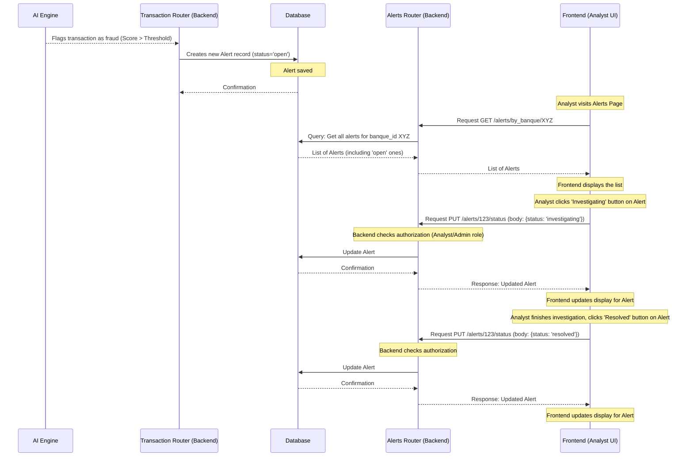

# Chapter 6: Alert Management

Welcome back to the Big Defend IA tutorial! In the last chapter, [Fraud Detection Core (AI Engine)](05_fraud_detection_core__ai_engine__.md), we learned how the AI Engine analyzes transactions and identifies potential fraud. That's a huge step – the system can now automatically flag suspicious activity!

But detecting fraud is only the first part. What happens after something suspicious is found? Someone needs to look at it, right? A human expert, like a fraud analyst, needs to review the flagged transaction, investigate further, and decide if it's truly fraudulent or just a false alarm.

This brings us to the concept of **Alert Management**.

### What is Alert Management?

Think of the AI Engine as automatically highlighting suspicious transactions with a bright yellow marker. The **Alert Management** system is like the process and tools that help the bank's investigators (fraud analysts) handle these highlighted items efficiently.

It's the system that:

1.  **Creates** a formal record (an "alert") for each suspicious activity flagged by the AI.
2.  **Stores** these alerts so they don't get lost.
3.  Allows analysts to **view** the list of alerts.
4.  Lets analysts **update the status** of an alert as they work on it (e.g., mark it as "investigating" or "resolved").

In short, Alert Management is the workflow and interface for human analysts to interact with the AI's findings.

### Our Use Case: Reviewing and Updating a Fraud Alert

Let's focus on a key task for a fraud analyst: **As a fraud analyst, I need to see the list of transactions flagged by the AI, understand the details of each alert, and update its status after I've reviewed it.**

How does Big Defend IA's Alert Management system support this?

### Key Concepts: Alerts and Statuses

The system revolves around two main concepts:

*   **Alerts:** These are specific records created in the database every time the AI flags a transaction above the fraud threshold (as we saw in Chapter 5). Each alert is linked to a specific transaction and contains information like the AI's fraud probability score, a message, and when it was created.
*   **Statuses:** Alerts have different statuses to indicate where they are in the review process. Common statuses include:

    | Status          | Description                                          | Who usually sets this? |
    | :-------------- | :--------------------------------------------------- | :--------------------- |
    | `open`          | The alert has just been created, no one is reviewing it yet. | System (AI)            |
    | `investigating` | An analyst has started looking into this alert.      | Analyst                |
    | `resolved`      | The analyst confirmed it was fraud or a false positive and closed the case. | Analyst                |
    | `false_positive` | The analyst determined it was not fraud. (Could be a type of `resolved` status) | Analyst                |

The goal of the Alert Management system is to allow analysts to easily see `open` or `investigating` alerts and move them towards a `resolved` state.

### How Alerts are Created (Recap from Chapter 5)

As we briefly saw in the last chapter, the creation of an alert happens automatically in the Backend when a new transaction is added and the AI's fraud probability score is high enough.

Looking back at the simplified `add_transaction` function in `app/routers/transaction.py`:

```python
# --- File: bdia-BackEND/app/routers/transaction.py (Snippet) ---
from fastapi import APIRouter, Depends, HTTPException
from sqlalchemy.orm import Session
from app.models.alert import Alert # Import the Alert model
from app.models.transaction import Transaction
from app.core.database import get_db
from app.schemas.transaction import TransactionCreate, TransactionRead
from app.services.fraud_detection import predict_fraud # Our AI function

router = APIRouter(prefix="/transactions", tags=["Transactions"])

@router.post("/add", response_model=TransactionRead)
def add_transaction(transaction: TransactionCreate, db: Session = Depends(get_db)):
    try:
        fraud_score = predict_fraud(transaction.dict())
        is_fraud = fraud_score > 0.8 # Check against threshold

        new_transaction = Transaction( # ... transaction details ... )

        db.add(new_transaction) # Save transaction
        db.commit()
        db.refresh(new_transaction)

        # --- THIS IS WHERE THE ALERT IS CREATED ---
        if is_fraud:
            alert = Alert(
                transaction_id=new_transaction.id, # Link to the transaction
                banque_id=transaction.banque_id,
                fraud_probability=fraud_score,
                message="Transaction suspecte détectée avec une probabilité de {:.2f}".format(fraud_score),
                # Status defaults to "non traité" (open) in the model definition
            )
            db.add(alert) # Add alert to database session
            db.commit() # Save the alert
            db.refresh(alert)
            print(f"Alert created for transaction {new_transaction.id}")
        # --- End Alert Creation ---

        return new_transaction

    except Exception as e:
        # ... error handling ...
        pass # Simplified
```

This small `if is_fraud:` block is the core logic that triggers the creation of a new `Alert` database record whenever the AI says a transaction is likely fraud.

### How Analysts View Alerts (Frontend)

Fraud analysts access the alerts through the Frontend application's "Alerts" page. This page needs to:

1.  Fetch the list of relevant alerts from the Backend API.
2.  Display them in a clear list or table.
3.  Potentially allow filtering by status or severity.

The `Alerts` page component (`pages/Alerts.tsx`) handles this display. It likely uses a custom hook, like `useDataset` or `useRealTimeData`, which in turn uses the API service (`apiService.ts`) to get data from the Backend.

Let's look at a simplified version of `pages/Alerts.tsx`:

```typescript
// --- File: bdia - FrontEND/src/pages/Alerts.tsx (Simplified) ---
import React, { useState, useEffect } from 'react';
// Assume useDataset or useRealTimeData fetches data and handles loading
// In the project's code, useRealTimeData uses apiService internally
import { useRealTimeData } from '../hooks/useRealTimeData'; 
import { FraudAlert } from '../types'; // Type definition for an Alert

const Alerts: React.FC = () => {
  // Fetch alerts, transactions (for details), and loading state using the hook
  const { alerts, transactions, loading, updateAlert } = useRealTimeData();
  const [selectedStatus, setSelectedStatus] = useState<string>('open'); // State for filtering

  // --- Display Loading State ---
  if (loading) {
    return (
      <div className="...">Chargement des alertes...</div>
    );
  }

  // --- Filtering Alerts ---
  const filteredAlerts = alerts.filter(alert => {
    // Only show alerts matching the selected status filter (defaulting to 'open')
    return selectedStatus === 'all' || alert.status === selectedStatus;
  });

  // Function to find the related transaction details
  const findTransactionForAlert = (alert: FraudAlert) => {
      return transactions.find(t => t.id === alert.transactionId);
  }

  // --- Rendering the Alert List ---
  return (
    <div className="space-y-6">
      <h1 className="text-3xl font-bold">Alertes BigDefend AI</h1>
      
      {/* Filter Controls */}
      <div className="flex gap-4">
        <select value={selectedStatus} onChange={(e) => setSelectedStatus(e.target.value)} className="...">
          <option value="all">Tous les statuts</option>
          <option value="open">Ouvert</option>
          <option value="investigating">En cours</option>
          <option value="resolved">Résolu</option>
          <option value="false_positive">Faux positif</option>
        </select>
        {/* ... Severity filter could go here ... */}
      </div>

      {/* List of filtered alerts */}
      <div className="grid gap-6">
        {filteredAlerts.map((alert) => {
          const transaction = findTransactionForAlert(alert); // Get transaction details

          return (
            <div key={alert.id} className="bg-white rounded-xl shadow-sm p-6">
              <div className="flex items-start justify-between">
                 {/* Display alert type, description, severity, status */}
                 <div>
                     <h3>{alert.type} - {alert.description}</h3>
                     <p>Probabilité fraude: {(alert.fraudProbability * 100).toFixed(1)}%</p>
                 </div>
                 <div>
                      <span className={`status-badge ${alert.status}`}>{alert.status}</span>
                      <span className={`severity-badge ${alert.severity}`}>{alert.severity}</span>
                 </div>
              </div>
              
              {/* Display related transaction details if found */}
              {transaction && (
                  <div className="mt-4 bg-slate-50 p-4 rounded">
                       <p>Transaction ID: {transaction.id}</p>
                       <p>Montant: {transaction.amount} {transaction.currency}</p>
                       {/* ... More transaction details like timestamp, location ... */}
                  </div>
              )}

              {/* --- Status Update Buttons --- */}
              <div className="mt-4 flex gap-2 justify-end">
                {alert.status === 'open' && (
                   <button 
                     onClick={() => updateAlert(alert.id, 'investigating')} 
                     className="px-4 py-2 bg-yellow-600 text-white rounded-lg">
                     En cours d'investigation
                   </button>
                )}
                {alert.status === 'investigating' && (
                   <>
                     <button 
                        onClick={() => updateAlert(alert.id, 'resolved')} 
                        className="px-4 py-2 bg-green-600 text-white rounded-lg">
                        Marquer comme Résolu
                      </button>
                      <button 
                        onClick={() => updateAlert(alert.id, 'false_positive')} 
                        className="px-4 py-2 bg-slate-600 text-white rounded-lg">
                        Marquer Faux Positif
                      </button>
                   </>
                )}
                {/* Add buttons for other transitions if needed */}
              </div>
              {/* --- End Status Update Buttons --- */}

            </div>
          );
        })}
      </div>

      {/* Message if no alerts */}
      {filteredAlerts.length === 0 && (
        <div className="text-center py-12">Aucune alerte trouvée.</div>
      )}
    </div>
  );
};

export default Alerts;
```

**Explanation:**

*   `useRealTimeData()`: This custom hook (from `hooks/useRealTimeData.ts`) is responsible for fetching the initial list of `alerts` and `transactions` from the Backend and also includes the `updateAlert` function for sending status changes. (Note: The real `useRealTimeData` also handles WebSockets for live updates, which we'll cover in Chapter 9).
*   `filteredAlerts = alerts.filter(...)`: This basic JavaScript filters the full list of alerts based on the user's selection in the status dropdown (`selectedStatus`).
*   Mapping `filteredAlerts`: The code iterates through the filtered list, creating a `div` for each `alert`.
*   Displaying Details: Inside the alert `div`, it shows key information like the type, description, and probability. It also finds and displays related transaction details using `findTransactionForAlert`.
*   Status Update Buttons: Crucially, it renders different buttons based on the current `alert.status`. For example, if the status is `'open'`, it shows a button to change it to `'investigating'`. If it's `'investigating'`, it shows buttons to change it to `'resolved'` or `'false_positive'`.
*   `onClick={() => updateAlert(alert.id, 'investigating')}`: When a button is clicked, it calls the `updateAlert` function from the hook, passing the alert's ID and the *new* desired status.

This Frontend code provides the visual list and the interactive elements (buttons) for analysts to work with alerts.

### How Analysts Update Alerts (Frontend & Backend)

When an analyst clicks one of the status buttons on the Frontend, a request is sent to the Backend API to make the change permanent in the database.

1.  **Frontend (`apiService.ts`):** The `updateAlert` function in the `useRealTimeData` hook calls a corresponding function in `apiService.ts` to send the request to the Backend.

    ```typescript
    // --- File: bdia - FrontEND/src/services/apiService.ts (Simplified) ---
    import axios from 'axios';
    // ... api instance setup (with auth interceptor from Chapter 2) ...

    // Function to update alert status on the Backend
    export const updateAlertStatus = async (
      alertId: string,
      status: string,
      assignedTo?: string // Optional field if assigning alerts
    ) => {
      const res = await api.put(`/alerts/${alertId}/status`, { status: status, assigned_to: assignedTo });
      return res.data; // Backend returns the updated alert
    };

    // ... other functions (getAlerts, getTransactions, etc.) ...
    ```
    This function makes a `PUT` request to a specific Backend endpoint, `/alerts/{alertId}/status`, sending the new `status` in the request body. The `api` instance automatically includes the authentication token (Chapter 2).

2.  **Backend (`app/routers/alerts.py`):** The Backend needs an API endpoint to receive this update request and modify the alert record in the database.

    ```python
    # --- File: bdia-BackEND/app/routers/alerts.py (Simplified) ---
    from fastapi import APIRouter, Depends, HTTPException, status
    from sqlalchemy.orm import Session
    from app.models.alert import Alert
    from app.schemas.alert import AlertRead, AlertUpdate # Need a schema for updates
    from app.core.database import get_db
    # Import dependency to get current authenticated user (for assigning)
    from app.auth.user_manager import fastapi_users
    from app.models.user import User # To type the current_user

    router = APIRouter(prefix="/alerts", tags=["Alerts"])

    # Dependency to require analyst or admin role for updating alerts (Authorization!)
    # Reusing or adapting a dependency from Chapter 3
    async def get_analyst_or_admin_user(current_user: User = Depends(fastapi_users.current_user())):
        if current_user.role not in ['analyst', 'admin']:
            raise HTTPException(
                status_code=status.HTTP_403_FORBIDDEN,
                detail="Not enough permissions to update alerts",
            )
        return current_user # Return the user object if authorized

    # Endpoint to update the status of a specific alert
    @router.put("/{alert_id}/status", response_model=AlertRead)
    def update_alert_status(
        alert_id: int, # Get alert ID from the URL path
        alert_update: AlertUpdate, # Get update data (status, assigned_to) from request body
        db: Session = Depends(get_db),
        # Require analyst or admin role to access this endpoint
        current_user: User = Depends(get_analyst_or_admin_user) 
    ):
        # Find the alert in the database by its ID
        alert = db.query(Alert).filter(Alert.id == alert_id).first()

        # If alert not found, return 404
        if alert is None:
            raise HTTPException(status_code=404, detail="Alert not found")

        # --- Update the alert object ---
        # Update status if provided and valid
        if alert_update.status:
             # Optional: Add validation here to ensure status transitions are allowed (e.g., can't go from resolved back to open)
            alert.status = alert_update.status
            
        # Update assigned_to if provided (and user is admin/analyst)
        # A more complex system might auto-assign the current_user.name if status goes to 'investigating'
        if alert_update.assigned_to:
            alert.assigned_to = alert_update.assigned_to
        # --- End Update ---

        # Save the changes to the database
        db.commit()
        db.refresh(alert) # Refresh to get the updated data back

        print(f"Alert {alert_id} status updated to '{alert.status}' by user {current_user.name}")

        return alert # Return the updated alert data to the Frontend

    # Need schema AlertUpdate
    # app/schemas/alert.py
    class AlertUpdate(BaseModel):
        status: str | None = None # Make status optional
        assigned_to: str | None = None # Allow setting assigned_to, also optional
    ```

**Explanation:**

*   `@router.put("/{alert_id}/status", ...)`: This defines the API endpoint that listens for `PUT` requests at `/alerts/` followed by an alert ID and `/status`. `alert_id: int` captures the ID from the URL.
*   `alert_update: AlertUpdate`: FastAPI uses the `AlertUpdate` schema to read the JSON data sent in the request body (which contains the new `status` and optionally `assigned_to`).
*   `current_user: User = Depends(get_analyst_or_admin_user)`: This is our **Authorization** check (from Chapter 3). Before running the `update_alert_status` function, FastAPI runs `get_analyst_or_admin_user`. If the authenticated user is not an 'analyst' or 'admin', a 403 Forbidden error is returned, and the function never runs. If they are authorized, the `current_user` object is provided.
*   `db.query(Alert).filter(...).first()`: This finds the specific alert record in the database using the provided `alert_id`.
*   `if alert is None`: Standard check to see if the alert was found. If not, return a 404 Not Found error.
*   `alert.status = alert_update.status`: This line updates the `status` field of the database object with the new status received from the Frontend.
*   `db.commit()`, `db.refresh(alert)`: Standard database commands to save the change and reload the object to get the latest data (including the updated status).
*   `return alert`: The Backend sends the fully updated alert object back to the Frontend, which the `useRealTimeData` hook uses to update its state and refresh the display without needing a full reload.

### The Alert Management Flow

Here's a diagram illustrating the journey of an alert from creation to resolution:



This diagram shows the journey: AI creates the alert, it's saved, the Frontend fetches it, the analyst updates it via the Backend API, and the Backend saves the status change to the database.

### Database Model for Alerts

The structure of the `Alert` records is defined in `app/models/alert.py`:

```python
# --- File: bdia-BackEND/app/models/alert.py ---
from sqlalchemy import Column, Integer, Float, String, ForeignKey, DateTime
from sqlalchemy.orm import relationship
from app.core.database import Base
from datetime import datetime

class Alert(Base):
    __tablename__ = "alerts" # Database table name

    id = Column(Integer, primary_key=True, index=True) # Unique ID for the alert
    transaction_id = Column(Integer, ForeignKey("transactions.id"), nullable=False) # Link to the transaction
    banque_id = Column(Integer, ForeignKey("users.id"), nullable=False) # Link to the bank/user it belongs to
    fraud_probability = Column(Float) # Score from the AI
    message = Column(String) # Descriptive message
    status = Column(String, default="open") # Current status, defaults to 'open'
    date = Column(DateTime, default=datetime.utcnow) # When the alert was created

    # Relationships to easily access linked transaction and bank data
    transaction = relationship("Transaction", backref="alert")
    banque = relationship("User", backref="alerts")

```

This defines the blueprint for each alert record stored in the database (which we'll explore more in [Database Management](08_database_management_.md)). It includes the essential fields needed to track and manage the alert.

### Conclusion

The **Alert Management** system bridges the gap between the AI's automated fraud detection and the human analysts who need to review and act on those findings. It provides the tools for analysts to view a centralized list of flagged transactions, access relevant details (including the AI score), and update the status of each alert through a clear workflow. By storing alerts in the database and providing dedicated API endpoints for viewing and updating them, the system ensures that potential fraud cases are tracked and handled efficiently.

Now that we understand how alerts are managed, let's look more broadly at how the system handles data, not just for alerts and transactions, but for all parts of the application.

Let's move on to the next chapter to explore the concepts of [Data Handling and Access](07_data_handling_and_access_.md).

[Data Handling and Access](07_data_handling_and_access_.md)