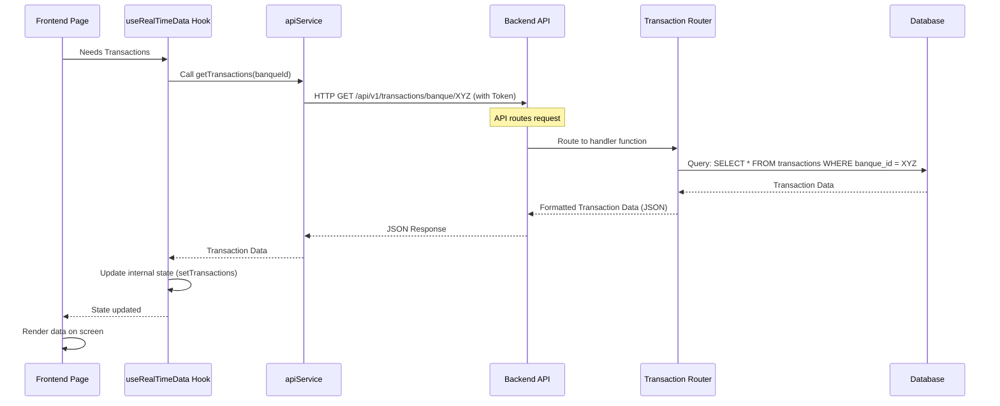

# Chapter 7: Data Handling and Access

Welcome back to the Big Defend IA tutorial! In our journey so far, we've seen how the system communicates ([Backend API (Communication Hub)](01_backend_api__communication_hub__.md)), verifies users ([Authentication System](02_authentication_system_.md)), manages what different users can do ([User and Role Management](03_user_and_role_management_.md)), and presents all of this in a user-friendly interface ([Frontend Application Structure](04_frontend_application_structure_.md)). We also looked at the core intelligence that spots fraud ([Fraud Detection Core (AI Engine)](05_fraud_detection_core__ai_engine__.md)) and how potential issues are tracked ([Alert Management](06_alert_management_.md)).

All these parts rely heavily on **information**. Where do we get the transaction details that the AI analyzes? Where do we store the alerts created? How does the Frontend get the list of transactions or alerts to display?

This is the job of **Data Handling and Access**. It's the layer responsible for getting the necessary data, organizing it, and providing it to different parts of the application when they need it.

### What is Data Handling and Access?

Imagine Big Defend IA is our bank again. The AI is an expert, the alerts are sticky notes about suspicious activity. But all this depends on records – ledgers of transactions, lists of customers, reports, etc.

**Data Handling and Access** is like the bank's record-keeping department. It's responsible for:

1.  **Storing Data:** Keeping all the important information (transactions, users, alerts, metrics) safe and organized. Our primary storage is a database ([Database Management](08_database_management_.md)), but we also have sample data for demos.
2.  **Retrieving Data:** Finding and fetching specific pieces of information when requested (like "show me all transactions for this client" or "give me the latest alerts").
3.  **Providing Data:** Making the retrieved data available to the parts of the application that need it, like the Frontend for display or the AI for analysis.

It's the system that lets the Frontend *ask* for data and the Backend *find* and *send back* that data.

### Our Use Case: Displaying Lists of Data

A very common task in Big Defend IA is simply showing a list of things – transactions, alerts, clients. Our core use case for this chapter is: **As a user, I want to see a list of relevant data (like my transactions, or alerts I can see) displayed in the Frontend application.**

How does the system handle getting this data from where it's stored and bringing it to your screen?

### Key Concepts: Data Sources and API Endpoints

The core ideas behind Data Handling and Access in Big Defend IA are:

1.  **Primary Data Source (Database):** The main, persistent storage for all application data is a PostgreSQL database ([Database Management](08_database_management_.md)). This is where transactions, users, alerts, etc., are truly saved.
2.  **Secondary Data Source (Mock Data):** For demonstration, testing, or when the backend database isn't running, the Frontend can fall back to using sample data stored directly within the Frontend code (`mockData.ts`).
3.  **Backend API Endpoints:** The Frontend doesn't talk directly to the database. It requests data from specific "addresses" on the Backend API ([Backend API (Communication Hub)](01_backend_api__communication_hub__.md)). These endpoints are designed to handle requests for specific types of data (e.g., `/transactions`, `/alerts`, `/clients`).
4.  **Frontend Data Services/Hooks:** On the Frontend, code is organized into services (`apiService.ts`) and custom hooks (`useRealTimeData.ts`) that know how to call the correct Backend API endpoints and manage the data received.

### How Data is Accessed and Handled (Real Data)

Let's follow the path of data when the Frontend needs to display a list of transactions (as partially seen in Chapter 1, but now focusing on data flow):

1.  The user navigates to the "Transactions" page on the Frontend.
2.  The page component needs transaction data. It calls a function provided by a data hook, like `useRealTimeData().getTransactions()`.
3.  The `useRealTimeData` hook calls a function in `apiService.ts` (e.g., `getTransactions(banqueId)`).
4.  The `apiService` constructs and sends an HTTP GET request to the Backend API's `/api/v1/transactions/banque/{banqueId}` endpoint. (Includes authentication token from Chapter 2).
5.  The Backend API receives the request and routes it to the correct handler function in `app/routers/transaction.py` ([Backend API (Communication Hub)](01_backend_api__communication_hub__.md)).
6.  The handler function uses a database dependency (`Depends(get_db)`) to get a connection to the database ([Database Management](08_database_management_.md)).
7.  Using the database connection object (`db`), the handler function executes a database query (e.g., `db.query(Transaction).filter(...).all()`) to fetch the transaction records for the requested bank ID.
8.  The database returns the matching transaction data to the Backend handler function.
9.  The Backend handler function formats this data into the correct structure (defined by Pydantic schemas like `TransactionRead`).
10. The Backend sends the formatted data back to the Frontend as a JSON response via the API.
11. The Frontend `apiService` receives the JSON data.
12. The `useRealTimeData` hook receives the data from `apiService`.
13. The hook updates its internal state (e.g., `setTransactions(data)`).
14. The Frontend component (`pages/Transactions.tsx`) that uses the hook detects the state change and re-renders, displaying the new list of transactions.

Here's a simple diagram showing this flow:



This shows the path data takes from storage to display.

### Code Snippets for Real Data Access

Let's revisit the minimal code examples that enable this flow.

**Frontend (`apiService.ts`)**: This file contains functions that abstract away the details of making HTTP requests.

```typescript
// --- File: bdia - FrontEND/src/services/apiService.ts (Snippet) ---
import axios from 'axios';
import { Transaction } from '../types';

const BASE_URL = 'http://localhost:8000/api/v1';
const api = axios.create({ baseURL: BASE_URL }); // Setup instance (interceptors omitted)

// ... interceptors for auth and error handling from Chapter 2 ...

// Function to get transactions for a specific bank ID
export const getTransactions = async (banqueId: number) => {
  console.log(`Fetching transactions for banque ID: ${banqueId}`);
  const res = await api.get(`/transactions/banque/${banqueId}`);
  console.log(`Received ${res.data.length} transactions.`);
  return res.data as Transaction[]; // Expect a list of Transaction objects
};

// Function to get alerts for a specific bank ID
export const getAlerts = async (banqueId: number) => {
    console.log(`Fetching alerts for banque ID: ${banqueId}`);
    const res = await api.get(`/alerts/banque/${banqueId}`);
    console.log(`Received ${res.data.length} alerts.`);
    return res.data as FraudAlert[]; // Expect a list of FraudAlert objects
};

// ... other functions for getting clients, metrics, etc. ...
```

This code defines simple async functions (`getTransactions`, `getAlerts`) that use the `axios` instance (`api`) to send GET requests to specific Backend endpoints and return the received data.

**Frontend (`useRealTimeData.ts`)**: This hook simplifies data fetching and state management for components.

```typescript
// --- File: bdia - FrontEND/src/hooks/useRealTimeData.ts (Snippet) ---
import { useState, useEffect, useCallback } from 'react';
import {
  getTransactions, // Import apiService functions
  getAlerts,
  getRiskMetrics,
  healthCheck, // Used for mock data fallback
} from '../services/apiService';
import { Transaction, FraudAlert, RiskMetrics } from '../types';
import { useAuth } from '../contexts/AuthContext'; // To get current user's banqueId

export const useRealTimeData = () => {
  const { user } = useAuth(); // Get logged-in user (includes banqueId)
  const [transactions, setTransactions] = useState<Transaction[]>([]); // State to hold transactions
  const [alerts, setAlerts] = useState<FraudAlert[]>([]); // State to hold alerts
  // ... other state (metrics, loading, error, connection) ...

  // Function to load data, used on component mount and refresh
  const loadInitialData = useCallback(async () => {
    if (!user) return; // Don't fetch if not logged in
    
    try {
      // ... setLoading(true) ...
      const isHealthy = await healthCheck(); // Check if backend is reachable

      if (isHealthy) {
        const banqueId = Number(user.id); // Get the user's banqueId (using user.id for simplicity)

        // Use Promise.all to fetch multiple types of data concurrently
        const [txns, alts, metrics] = await Promise.all([
          getTransactions(banqueId), // Call apiService function
          getAlerts(banqueId),       // Call apiService function
          getRiskMetrics(),          // Call apiService function
        ]);

        setTransactions(txns); // Update state with fetched data
        setAlerts(alts);
        setRiskMetrics(metrics);
      } else {
        // --- FALLBACK TO MOCK DATA (explained next) ---
        console.warn('Backend not available, using mock data');
        const { DataService } = await import('../services/dataService');
        const dataService = DataService.getInstance();
        await dataService.loadDataset(); // Load mock data from file

        setTransactions(dataService.getTransactions()); // Get data from mock service
        setAlerts(dataService.getAlerts());
        setRiskMetrics(dataService.getRiskMetrics());
        // --- END FALLBACK ---
      }
    } catch (err) {
      // ... error handling ...
    } finally {
      // ... setLoading(false) ...
    }
  }, [user]); // Dependency array: rerun if user changes

  // Effect to load data when the hook is first used or user changes
  useEffect(() => {
     // ... websocket setup (Chapter 9) ...
     loadInitialData(); // Call the data loading function

     // ... cleanup function ...
  }, [loadInitialData]); // Dependency array: rerun if loadInitialData changes

  return {
    transactions, // Provide data from state
    alerts,
    riskMetrics,
    loading,
    error,
    isConnected,
    refreshData: loadInitialData, // Provide a function to refresh
    // ... updateAlert, analyzeTransaction functions ...
  };
};
```

This hook calls the `apiService` functions to fetch different types of data (`transactions`, `alerts`, `riskMetrics`) when it's initialized (`useEffect`). It uses `useState` to store this data and provides it to any component that uses the hook. This abstracts away the fetching logic from the UI components.

**Backend (`app/routers/transaction.py`)**: This file contains the API endpoint handler.

```python
# --- File: bdia-BackEND/app/routers/transaction.py (Snippet) ---
from fastapi import APIRouter, Depends
from sqlalchemy.orm import Session # Used to interact with database
from app.models.transaction import Transaction # SQLAlchemy model definition
from app.schemas.transaction import TransactionRead # Pydantic schema for output
from app.core.database import get_db # Dependency to get database session

router = APIRouter(prefix="/transactions", tags=["Transactions"])

# Endpoint to get transactions filtered by bank ID
@router.get("/banque/{banque_id}", response_model=list[TransactionRead])
def get_transactions_by_banque(
    banque_id: int, # Get ID from URL path
    db: Session = Depends(get_db) # Get database session via dependency
):
    """Fetches transactions for a specific bank."""
    # --- Database Query ---
    # Use the db session to query the Transaction model
    transactions_list = db.query(Transaction).filter(Transaction.banque_id == banque_id).all()
    # --- End Database Query ---
    
    # FastAPI automatically converts the list of model objects
    # into the specified Pydantic schema (TransactionRead) and then to JSON.
    return transactions_list
```

This Backend code defines the `/transactions/banque/{banque_id}` endpoint. It gets a database session (`db`) using `Depends(get_db)` and then uses SQLAlchemy's `db.query(...)` to retrieve data from the `transactions` table in the database, filtering by the requested `banque_id`. The results are automatically formatted and returned.

### How Data is Accessed and Handled (Mock Data Fallback)

The Big Defend IA Frontend is designed to be able to run even if the Backend isn't fully operational, using **mock data**. This is handled within the `useRealTimeData` hook using the `healthCheck` from `apiService.ts` and the `DataService` class.

Let's look again at the relevant snippet in `useRealTimeData.ts`:

```typescript
// --- File: bdia - FrontEND/src/hooks/useRealTimeData.ts (Mock Data Snippet) ---
// ... imports ...
import { healthCheck } from '../services/apiService';
// Import the DataService class for mock data
import { DataService } from '../services/dataService'; 

export const useRealTimeData = () => {
  // ... state and loadInitialData definition ...

  const loadInitialData = useCallback(async () => {
    if (!user) return;
    try {
      // ... setLoading(true), setError(null) ...

      // Check if the Backend is reachable and healthy
      const isHealthy = await healthCheck(); 

      if (isHealthy) {
        // --- REAL DATA PATH (shown above) ---
        // ... fetch data from apiService ...
        // ... setTransactions(txns), setAlerts(alts), etc. ...
      } else {
        // --- MOCK DATA PATH ---
        console.warn('Backend not available, using mock data');
        // Get the single instance of the DataService
        const dataService = DataService.getInstance();
        // Load the mock data from the CSV file (or internal fallback)
        await dataService.loadDataset(); 

        // Get data arrays directly from the DataService instance
        setTransactions(dataService.getTransactions());
        setAlerts(dataService.getAlerts());
        setRiskMetrics(dataService.getRiskMetrics());
        // --- END MOCK DATA PATH ---
      }
    } catch (err) {
      // ... error handling ...
    } finally {
      // ... setLoading(false) ...
    }
  }, [user]);

  // ... useEffect to call loadInitialData ...

  return {
    transactions, 
    alerts,
    riskMetrics,
    // ... other return values ...
  };
};
```

**Explanation:**

1.  `healthCheck()`: This function (in `apiService.ts`) makes a simple request to a Backend health endpoint (`/health`). If it gets a success response, `isHealthy` is true.
2.  `if (isHealthy)`: If the backend is healthy, the hook proceeds to fetch data via the standard `apiService` calls (real data path).
3.  `else`: If the backend is *not* healthy, the code enters the mock data path.
4.  `DataService.getInstance()`: This gets the single instance of a class designed to load and hold the mock data.
5.  `dataService.loadDataset()`: This method (defined in `bdia - FrontEND/src/services/dataService.ts`) reads a CSV file (like `creditcard.csv` included in the project, or falls back to internal mock arrays if the CSV isn't available/loadable). It parses the data and stores it internally.
6.  `dataService.getTransactions()`, `dataService.getAlerts()`, etc.: These methods simply return the data arrays that the `DataService` loaded and holds.
7.  `setTransactions(...)`, `setAlerts(...)`: The hook then updates its state using this mock data, just as it would with real data.

This setup allows the Frontend to function for demonstration purposes without a running Backend database. The `dataService.ts` file contains the logic for loading, parsing, and generating relationships within this mock data.

Here's a look at where that mock data initially resides:

```typescript
// --- File: bdia - FrontEND/src/data/mockData.ts (Snippet) ---
import { Transaction, FraudAlert, Client, RiskMetrics } from '../types';

// Define sample transaction data directly in a variable
export const mockTransactions: Transaction[] = [
  {
    id: '1',
    amount: 15000,
    currency: 'EUR',
    timestamp: new Date('2024-01-15T10:30:00'),
    fromAccount: 'ACC001',
    toAccount: 'ACC002',
    type: 'transfer',
    status: 'flagged',
    riskScore: 85,
    fraudProbability: 0.78,
    location: 'Paris, France',
    deviceInfo: 'Mobile App - iOS',
    features: {} // Example structure
  },
  // ... more mock transactions ...
];

// Define sample alert data
export const mockAlerts: FraudAlert[] = [
  {
    id: '1',
    transactionId: '1', // Link to mockTransaction with id '1'
    severity: 'high',
    type: 'Unusual Amount',
    description: 'Transaction amount significantly higher...',
    timestamp: new Date('2024-01-15T10:31:00'),
    status: 'investigating',
    assignedTo: 'analyst@bank.com'
  },
  // ... more mock alerts ...
];

// ... mock data for clients, risk metrics, etc. ...
```
The `DataService` can use these predefined arrays as a last resort if reading the CSV fails, or it can load and process a larger CSV dataset to create more realistic mock data, as implemented in the project's `dataService.ts`. The key is that this mock data provides the necessary structure (`Transaction[]`, `FraudAlert[]`) that the Frontend components expect.

### Data Handling and Role-Based Access

As mentioned in [User and Role Management](03_user_and_role_management_.md), data access is also controlled based on the user's role. This happens primarily on the **Backend**. When the Backend fetches data from the database, the query itself is often filtered based on the authenticated user's ID or role.

For example, the `get_transactions_by_banque` endpoint in `app/routers/transaction.py` already filters by `banque_id`:

```python
# --- File: bdia-BackEND/app/routers/transaction.py (Filtering Snippet) ---
@router.get("/banque/{banque_id}", response_model=list[TransactionRead])
def get_transactions_by_banque(
    banque_id: int, 
    db: Session = Depends(get_db)
    # NOTE: For security, this endpoint would also need
    # a dependency to check if the *current authenticated user*
    # is authorized to view data for the requested banque_id.
    # E.g., using Depends(fastapi_users.current_user()) and checking user.banque_id
):
    # This query gets transactions ONLY for the specified bank ID
    transactions_list = db.query(Transaction).filter(Transaction.banque_id == banque_id).all()
    return transactions_list
```

And endpoints that should only be accessed by admins (like managing users) use role-checking dependencies (as seen in Chapter 3) *before* querying any sensitive data. This ensures that even if the Frontend requests data it shouldn't have access to, the Backend prevents it.

### The Role of the Database Layer

While this chapter covers the *accessing* and *handling* of data, the actual structure and management of the persistent storage is handled by the database layer ([Database Management](08_database_management_.md)). The `app/core/database.py` file contains the connection logic and the `app/models/` folder contains the Python class definitions (like `Transaction`, `Alert`, `User`) that map to the tables and columns in the PostgreSQL database.

The `get_db()` dependency is the bridge, providing a `Session` object that the Backend routers use to interact with the database using SQLAlchemy (an Object-Relational Mapper - ORM, which lets you interact with databases using Python objects instead of raw SQL).

```python
# --- File: bdia-BackEND/app/core/database.py (Snippet) ---
from sqlalchemy import create_engine
from sqlalchemy.orm import sessionmaker
from app.models.base import Base # Base class for our models
from app.core.config import settings # For getting database URL

# Setup for synchronous database access (used by get_db)
sync_engine = create_engine(settings.SYNC_DATABASE_URL)
SyncSessionLocal = sessionmaker(bind=sync_engine)

# Dependency function to get a database session
def get_db():
    db = SyncSessionLocal() # Create a new session
    try:
        yield db # Provide the session to the function that requested it
    finally:
        db.close() # Close the session afterwards
```
This small function is injected into API route handlers using `Depends(get_db)`, giving them the necessary object (`db`) to perform database operations like querying (`db.query(...)`), adding (`db.add(...)`), or updating (`db.commit()`).

### Conclusion

**Data Handling and Access** is fundamental to the operation of Big Defend IA. It ensures that all parts of the system, from the Frontend UI to the AI Engine, can obtain the information they need, whether from the primary database or from mock data sources for demonstration. By centralizing API calls in `apiService.ts`, managing fetched data state with hooks like `useRealTimeData.ts`, and implementing database interactions on the Backend routers using dependencies and ORM tools like SQLAlchemy, the project provides a structured way to handle information flow. Crucially, authorization checks on the Backend ensure that data access respects user roles and permissions defined by [User and Role Management](03_user_and_role_management_.md).

Now that we understand *how* data is accessed, let's delve deeper into *where* it's stored and how its structure is managed in the database itself.

Let's move on to the next chapter to explore the concepts of [Database Management](08_database_management_.md).

[Database Management](08_database_management_.md)