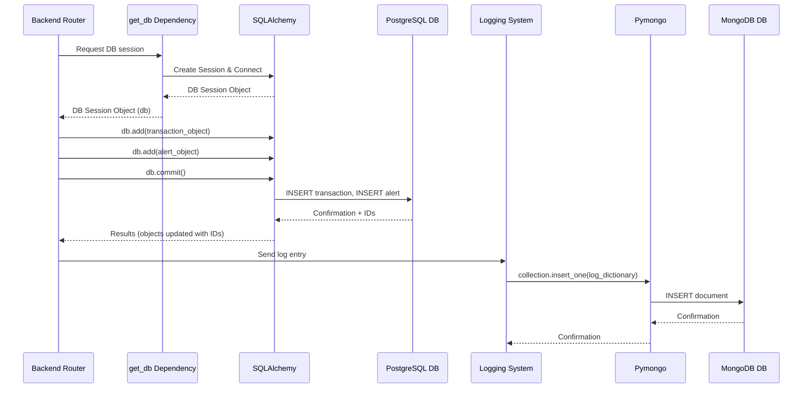

# Chapter 8: Database Management

Welcome back to the Big Defend IA tutorial! In the last chapter, [Data Handling and Access](07_data_handling_and_access_.md), we saw how different parts of the application, especially the Frontend, request and receive data. We learned that this data often comes from a central storage location managed by the Backend.

Now, let's open the door to that central storage location itself. This chapter is all about **Database Management** – how our application securely saves, organizes, and retrieves all the important information it needs to function.

### What is Database Management?

Imagine our Big Defend IA bank again. We've got customer records, transaction ledgers, employee details, security reports, and lots of notes about suspicious activity. All this information needs to be stored somewhere safe and organized so people can find it when they need it.

**Database Management** is like the bank's highly secure and organized archives department and vaults. It's where the application's **persistent data** lives. "Persistent" means the data stays there even if the application is shut down and restarted. Without it, everything would disappear whenever you closed the app!

In Big Defend IA, we use not one, but **two** different types of databases for different purposes:

1.  **Relational Database (PostgreSQL):** Think of this like perfectly organized filing cabinets with strict rules. It's great for structured data that relates to other data, like:
    *   **Users:** Connected to their roles.
    *   **Transactions:** Connected to users/banks, and potentially linked to alerts.
    *   **Alerts:** Directly linked to transactions.
2.  **NoSQL Database (MongoDB):** Think of this more like flexible storage bins. It's good for data that might have less rigid structure, like:
    *   **Logs:** Records of what the application is doing, errors, user actions, etc. Each log entry might have slightly different details.

Using two types allows us to pick the best tool for the job!

### Our Use Case: Saving Important Information

Let's consider the flow we discussed in previous chapters: **When a new transaction arrives and is flagged as potentially fraudulent, the system needs to save the transaction details and create a new alert record.** This information must be stored reliably so it can be reviewed later.

How does Big Defend IA use its databases to make sure this crucial information is saved?

### Key Concepts: Databases and ORM/ODM

To save and retrieve data, the Backend needs to talk to these database servers. Here are the key concepts involved:

1.  **Database Servers:** These are separate programs (like PostgreSQL and MongoDB) running somewhere that are designed specifically to store and manage large amounts of data. In our project, we run them using Docker (we'll see this later).
2.  **Database Connection:** The Backend application needs a way to connect to these servers over the network. Connection details (like address, username, password) are stored securely in configuration.
3.  **Models:** In our Python Backend code, we define Python classes (like `User`, `Transaction`, `Alert`) that describe the structure of the data we want to store. These "models" are like blueprints that tell the application how the data should look in the database tables (for PostgreSQL) or documents (conceptually, for MongoDB).
4.  **ORM (Object-Relational Mapper):** For the **Relational** database (PostgreSQL), we use **SQLAlchemy**. This is a powerful tool that lets us interact with the database using Python objects and methods (like `db.add(transaction)`, `db.query(Alert).filter(...)`) instead of writing raw SQL code (like `INSERT INTO transactions ...`, `SELECT * FROM alerts WHERE ...`). It "maps" Python objects to database rows.
5.  **ODM (Object-Document Mapper) / Driver:** For the **NoSQL** database (MongoDB, used for logs), we use **Pymongo**. This is a Python library that lets us interact with MongoDB using Python dictionaries and commands (like `collection.insert_one(log_entry)`). It maps Python dictionaries/objects to database documents.

| Database Type       | Analogy                  | What it stores                 | Python Tool     | Where it's used in BDIA       |
| :------------------ | :----------------------- | :----------------------------- | :-------------- | :---------------------------- |
| **Relational (PostgreSQL)** | Organized Filing Cabinets | Structured, Linked Data (Users, Transactions, Alerts) | SQLAlchemy (ORM) | Core application data         |
| **NoSQL (MongoDB)**   | Flexible Storage Bins    | Semi-structured Data (Logs)  | Pymongo (Driver) | Application logging           |

### How Data is Saved (Putting it Together)

Let's trace the saving process for our use case (new transaction + alert), linking it back to code we've seen.

When the `add_transaction` endpoint in `app/routers/transaction.py` receives a new transaction:

1.  It first gets a **database session** object using a **dependency** (`db: Session = Depends(get_db)`). This session is like a temporary workspace connected to the PostgreSQL database.
2.  It creates a **Python object** based on the `Transaction` model (`new_transaction = Transaction(...)`).
3.  It uses the session object and SQLAlchemy's `add` method to stage the new transaction object for saving (`db.add(new_transaction)`). This is like placing a new document in the "outbox" for saving.
4.  If the AI flags it as fraud, it creates another **Python object** based on the `Alert` model (`alert = Alert(...)`), linking it to the transaction.
5.  It adds the alert object to the session (`db.add(alert)`).
6.  Finally, it uses the session object and SQLAlchemy's `commit` method (`db.commit()`) to tell the database to permanently save *all* the staged changes (the new transaction and the new alert).
7.  `db.refresh(new_transaction)` and `db.refresh(alert)` are often used after committing to load the latest data from the database into the Python objects, including the automatically generated IDs.

Meanwhile, if the system needs to save a log entry (e.g., recording the transaction being added, or an error), it uses the separate logging system which talks to MongoDB:

1.  The logging system creates a **Python dictionary** representing the log entry.
2.  It uses the Pymongo library to interact with the MongoDB **collection** (similar to a table in relational DBs).
3.  It uses the `insert_one` method (`collection.insert_one(log_entry)`) to save the dictionary as a new **document** in the MongoDB database.

### Code Snippets for Database Interaction

Let's look at the simplified code pieces that enable this interaction.

**Getting a Database Session (PostgreSQL - `app/core/database.py`):**

```python
# --- File: bdia-BackEND/app/core/database.py (Snippet) ---
from sqlalchemy import create_engine
from sqlalchemy.orm import sessionmaker
from app.core.config import settings # Database URL comes from here

# Setup for synchronous database access
sync_engine = create_engine(settings.SYNC_DATABASE_URL) # Connects to the DB
SyncSessionLocal = sessionmaker(bind=sync_engine) # Creates sessions

# Dependency function to get a database session
def get_db():
    db = SyncSessionLocal() # Create a new session
    try:
        yield db # Provide the session object
    finally:
        db.close() # Close the session when done
```

**Explanation:**

*   `create_engine`: This function sets up the connection details to the PostgreSQL database using the URL from `settings.SYNC_DATABASE_URL` (defined in `.env` and loaded via `app/core/config.py`).
*   `sessionmaker`: This creates a "factory" that can generate database session objects.
*   `get_db()`: This is a special "dependency" function for FastAPI. When a route handler includes `db: Session = Depends(get_db)`, FastAPI calls `get_db()`, gets the session object (`db`), passes it to the handler, and then automatically runs the `finally` block (`db.close()`) when the handler finishes, ensuring connections are cleaned up.

**Defining Database Models (PostgreSQL - `app/models/transaction.py` & `app/models/alert.py`):**

```python
# --- File: bdia-BackEND/app/models/transaction.py (Snippet) ---
from sqlalchemy import Column, Integer, Float, String, Boolean, DateTime, ForeignKey
from app.core.database import Base # Base class for models
# from sqlalchemy.orm import relationship # Used for linking models

class Transaction(Base): # Inherit from Base
    __tablename__ = "transactions" # Name of the table in the database

    id = Column(Integer, primary_key=True, index=True) # Integer column, primary key
    banque_id = Column(Integer, ForeignKey("users.id"), nullable=False) # Link to users table
    transaction_amount = Column(Float) # Decimal number column
    timestamp = Column(DateTime) # Date and time column
    is_fraud = Column(Boolean) # True/False column
    fraud_probability = Column(Float) # Decimal number column
    # ... other columns ...
```

```python
# --- File: bdia-BackEND/app/models/alert.py (Snippet) ---
from sqlalchemy import Column, Integer, Float, String, ForeignKey, DateTime
from app.core.database import Base
# from sqlalchemy.orm import relationship

class Alert(Base):
    __tablename__ = "alerts" # Name of the table in the database

    id = Column(Integer, primary_key=True, index=True)
    transaction_id = Column(Integer, ForeignKey("transactions.id"), nullable=False) # Link to transactions table
    fraud_probability = Column(Float)
    message = Column(String) # Text column
    status = Column(String, default="non traité") # Text column with a default value
    date = Column(DateTime)
    # ... other columns ...
```

**Explanation:**

*   `Base`: A special class from SQLAlchemy that our models inherit from. It helps SQLAlchemy understand how to create database tables from these classes.
*   `__tablename__`: Specifies the name of the table that this class maps to in PostgreSQL.
*   `Column(...)`: Defines a column in the database table.
    *   `Integer`, `Float`, `String`, `Boolean`, `DateTime`: Data types for the columns.
    *   `primary_key=True`: Marks this column as the unique identifier for rows.
    *   `index=True`: Creates an index on this column for faster lookups.
    *   `ForeignKey(...)`: Links this column to the `id` column of another table, enforcing relationships.
    *   `nullable=False`: Means this column cannot be empty.
    *   `default=...`: Sets a default value if not specified when creating a new record.

**Saving Data in a Router (PostgreSQL - `app/routers/transaction.py`):**

```python
# --- File: bdia-BackEND/app/routers/transaction.py (Saving Snippet) ---
from fastapi import APIRouter, Depends # ... other imports ...
from sqlalchemy.orm import Session # Import Session type for dependency
from app.models.transaction import Transaction # Import models
from app.models.alert import Alert
from app.core.database import get_db # Import the dependency

router = APIRouter(prefix="/transactions", tags=["Transactions"])

@router.post("/add", response_model=TransactionRead)
def add_transaction(
    transaction: TransactionCreate, # Incoming data validated by schema
    db: Session = Depends(get_db) # <-- Get the database session here
):
    # ... predict_fraud logic ...
    is_fraud = True # Simplified
    fraud_score = 0.9 # Simplified

    # Create Python objects based on models
    new_transaction = Transaction(
        **transaction.dict(),
        is_fraud=is_fraud,
        fraud_probability=fraud_score,
    )

    # --- Use the db session to save to PostgreSQL ---
    db.add(new_transaction) # Stage the new transaction
    db.commit() # Save the transaction to the database
    db.refresh(new_transaction) # Get the transaction back with its new ID

    if is_fraud:
        alert = Alert(
            transaction_id=new_transaction.id, # Use the new transaction ID
            banque_id=new_transaction.banque_id,
            fraud_probability=fraud_score,
            message="Suspect transaction...",
            # status defaults to 'non traité'
        )
        db.add(alert) # Stage the new alert
        db.commit() # Save the alert
        db.refresh(alert) # Get the alert back with its new ID
    # --- End Saving ---

    return new_transaction # Return the saved transaction
```

**Explanation:**

*   `db: Session = Depends(get_db)`: This is the core line showing how the `get_db` dependency provides the `db` session object to the function.
*   `db.add(...)`: Prepares an object (a row) to be inserted into the database.
*   `db.commit()`: Executes the pending insertions/updates/deletions in the database. This is when the data is actually saved permanently.
*   `db.refresh(...)`: Updates the Python object with the current data from the database, which is important if the database generated values like the `id`.

**Connecting to MongoDB (Logging - `app/logging/mongo_connection.py`):**

```python
# --- File: bdia-BackEND/app/logging/mongo_connection.py (Snippet) ---
import os
from pymongo import MongoClient # Import the MongoDB driver
from dotenv import load_dotenv

# Load connection details from environment variables (.env file)
load_dotenv()
MONGO_URL = os.getenv("MONGO_URL", "mongodb://localhost:27017")
MONGO_DB_NAME = os.getenv("MONGO_DB_NAME", "bigdefend_logs")
MONGO_COLLECTION_NAME = os.getenv("MONGO_COLLECTION_NAME", "logs")

client = None
collection = None

def init_mongo():
    global client, collection
    try:
        # --- Connect to MongoDB ---
        client = MongoClient(MONGO_URL, serverSelectionTimeoutMS=5000)
        client.admin.command('ping') # Check connection
        db = client[MONGO_DB_NAME] # Select the database
        collection = db[MONGO_COLLECTION_NAME] # Select the collection
        print("✅ MongoDB connected...")
    except Exception as e:
        print(f"❌ MongoDB connection failed: {e}")
        collection = None # Set collection to None if connection fails

init_mongo() # Connect when the module is imported
```

**Explanation:**

*   `pymongo.MongoClient`: This is the main class from the Pymongo library used to establish a connection to the MongoDB server using the `MONGO_URL`.
*   `client[MONGO_DB_NAME]`: Accesses a specific database within the MongoDB server.
*   `db[MONGO_COLLECTION_NAME]`: Accesses a specific collection within that database. `collection` is the object we'll use to insert documents.
*   `init_mongo()`: This function handles the connection setup. It's called once when this Python file is loaded by the application.

**Saving a Log Entry (MongoDB - `app/logging/mongodb_logger.py`):**

```python
# --- File: bdia-BackEND/app/logging/mongodb_logger.py (Snippet) ---
import logging
from datetime import datetime
from app.logging.mongo_connection import collection # Import the connected collection object

class MongoDBHandler(logging.Handler): # Custom handler for Python's logging
    def __init__(self):
        super().__init__()
        if collection is None: # Check if MongoDB connection succeeded
            raise Exception("MongoDB collection not initialized")
        self.collection = collection

    def emit(self, record):
        # --- Prepare data as a dictionary ---
        log_entry = {
            "timestamp": datetime.utcnow().isoformat(),
            "level": record.levelname,
            "message": record.getMessage(),
            # ... other data from the log record (transaction_id, user_id, etc.) ...
        }
        # --- Use Pymongo to save the dictionary (document) ---
        try:
            self.collection.insert_one(log_entry)
        except Exception as e:
            print(f"[ERROR] Failed to insert log in MongoDB: {e}")
```

**Explanation:**

*   `MongoDBHandler`: This class integrates MongoDB saving with Python's standard logging system.
*   `emit(self, record)`: This method is called by the logging system whenever a log message is processed by this handler.
*   `log_entry = { ... }`: A Python dictionary is created, containing the data for the log entry. MongoDB stores data as documents, which are essentially key-value pairs similar to Python dictionaries.
*   `self.collection.insert_one(log_entry)`: This command uses the connected `collection` object (from `mongo_connection.py`) and Pymongo's `insert_one` method to save the `log_entry` dictionary as a new document in the specified MongoDB collection.

### Under the Hood: Database Servers

Where are these database servers running? In the Big Defend IA project setup, they are typically run as separate services using **Docker**. The `docker-compose.yml` file defines these services:

```yaml
# --- File: bdia-BackEND/docker-compose.yml (Relevant Snippets) ---
version: '3.8'

services:
  # ... fastapi service definition (commented out in original) ...

  postgres: # PostgreSQL service
    image: postgres:13
    container_name: postgres_bdia
    environment: # Connection details used by the backend
      POSTGRES_USER: bdia_user
      POSTGRES_PASSWORD: bdia_pass
      POSTGRES_DB: bdia_db
    ports:
      - "5432:5432" # Map container port to host port
    volumes:
      - pgdata:/var/lib/postgresql/data # Store data persistently outside container
    networks:
      - app-network

  pgadmin: # Optional tool to view PostgreSQL data via web browser
    image: dpage/pgadmin4
    container_name: pgadmin_bdia
    environment:
      PGADMIN_DEFAULT_EMAIL: admin@bdia.com
      PGADMIN_DEFAULT_PASSWORD: admin
    ports:
      - "5050:80"
    depends_on:
      - postgres
    networks:
      - app-network

  mongo: # MongoDB service
    image: mongo:latest
    container_name: mongo_logs
    restart: always
    ports:
      - "27017:27017" # Map container port to host port
    environment:
      MONGO_INITDB_DATABASE: logs_db
    volumes:
      - mongodata:/data/db # Store data persistently
    networks:
      - app-network

  mongo-express: # Optional tool to view MongoDB data via web browser
    image: mongo-express
    container_name: mongo_express_logs
    restart: always
    ports:
      - "8081:8081"
    environment: # Connect to the mongo service
      ME_CONFIG_MONGODB_SERVER: mongo
      ME_CONFIG_BASICAUTH_USERNAME: admin
      ME_CONFIG_BASICAUTH_PASSWORD: admin
    depends_on:
      - mongo
    networks:
      - app-network

# ... networks and volumes definitions ...
```

**Explanation:**

*   `postgres`: This section defines the PostgreSQL database server. It uses a standard image, sets up environment variables for user/password/database name (matching what's expected in the backend's `.env` file), maps port 5432 for connections, and uses a `volume` (`pgdata`) to ensure the actual database files are stored outside the container, so data isn't lost if the container is stopped or removed.
*   `pgadmin`: This is a web-based administration tool for PostgreSQL, useful for viewing tables and data directly.
*   `mongo`: This section defines the MongoDB database server, similar to PostgreSQL, mapping port 27017 and using a `volume` (`mongodata`) for persistence.
*   `mongo-express`: This is a web-based administration tool for MongoDB, useful for viewing collections and documents.
*   `networks`: These define internal networks so the backend service (if uncommented) can find `postgres` and `mongo` using their service names.

When you run `docker-compose up`, these database servers start up, and the Backend application connects to them using the configured URLs and credentials.

### The Flow with Database Interaction

Here's a simple diagram showing how data is saved for our use case:



This diagram shows that the Backend router acts as the orchestrator, using the `get_db` dependency to get a connection object (`db`) for PostgreSQL via SQLAlchemy, performing save operations, and also interacting with the separate Logging System which saves logs to MongoDB via Pymongo.

### Conclusion

**Database Management** is the backbone of persistence for the Big Defend IA application. By using both a **Relational Database (PostgreSQL)** for structured application data (users, transactions, alerts) accessed via **SQLAlchemy (ORM)** and a **NoSQL Database (MongoDB)** for flexible data like logs accessed via **Pymongo**, the system efficiently stores different types of information. The Backend API handles interactions with these databases through dedicated functions and dependencies, ensuring data is saved and retrieved reliably to support all the application's features.

Now that we've explored how data is stored, let's look at how the application handles communicating changes to that data to the user interface in real-time.

Let's move on to the next chapter to explore the concepts of [Real-time Data Flow (WebSockets)](09_real_time_data_flow__websockets__.md).

[Real-time Data Flow (WebSockets)](09_real_time_data_flow__websockets__.md)