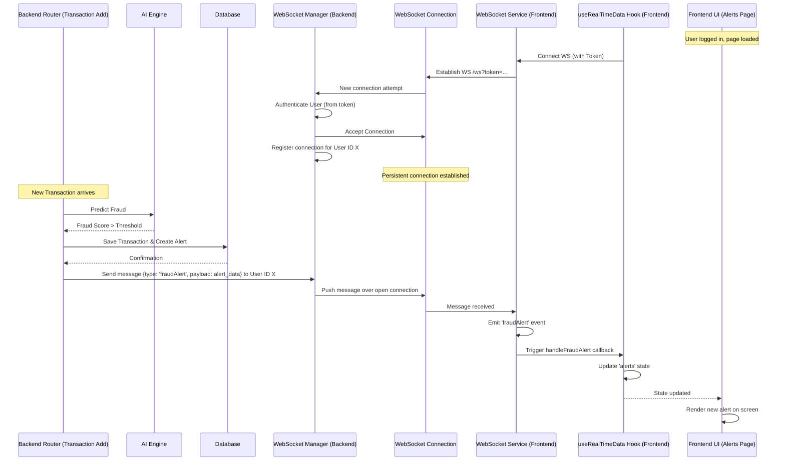

# Chapter 9: Real-time Data Flow (WebSockets)

Welcome back to the Big Defend IA tutorial! In our previous chapter, [Database Management](08_database_management_.md), we explored how the application stores all its critical information persistently in different types of databases. We learned how the Backend uses tools like SQLAlchemy and Pymongo to save and retrieve data when asked by the Frontend.

But sometimes, simply asking for data isn't enough. Imagine you're a fraud analyst watching the dashboard. If a new, urgent fraud alert is triggered by the [Fraud Detection Core (AI Engine)](05_fraud_detection_core__ai_engine__.md), waiting for you to manually refresh the page to see it isn't ideal. You need to know *instantly*!

This is where **Real-time Data Flow**, specifically using **WebSockets**, comes in.

### What is Real-time Data Flow (WebSockets)?

Think back to how the [Backend API (Communication Hub)](01_backend_api__communication_hub__.md) usually works with the Frontend. It's like calling the bank on the phone:

*   Frontend: "Hello bank? Do you have any new transactions for me?" (Sends HTTP GET request)
*   Backend: "Yes, here's the list." (Sends HTTP response)
*   Frontend: "Okay, thanks. ... Hello bank? Anything new *now*?" (Sends another HTTP GET request)

This works, but it means the Frontend has to keep asking over and over again, and there's always a delay between something happening on the Backend and the Frontend finding out.

**WebSockets** change this. Instead of making separate calls for every question, the Frontend and Backend set up a dedicated, open phone line between them. Once this line is open:

1.  The Frontend can send messages to the Backend.
2.  Crucially, the **Backend can send messages back to the Frontend *at any time* without the Frontend having to ask.**

This "server push" capability is the core of real-time updates.

### Our Use Case: Instant Notifications for New Alerts

The central task WebSockets help us with in Big Defend IA is keeping the user interface immediately updated with critical changes: **As a logged-in user viewing the dashboard or alerts page, I want to see new potential fraud alerts appear on my screen as soon as the AI flags them, without manually refreshing the page.**

How does the application use WebSockets to achieve this instant notification?

### Key Concepts: Persistent Connections and Event Handling

The real-time flow relies on a few main ideas:

1.  **WebSocket Connection:** When the Frontend application loads and the user logs in, it establishes a single, persistent connection to a specific WebSocket endpoint on the Backend. This connection stays open as long as the user's browser tab is open and the network is stable.
2.  **Server-Side Logic:** The Backend application keeps track of which Frontend clients are connected via WebSockets.
3.  **Pushing Messages:** When an event happens on the Backend that the Frontend needs to know about immediately (like a new alert being created, as seen in [Alert Management](06_alert_management_.md)), the Backend sends a message *over the open WebSocket connection* to the relevant Frontend client(s).
4.  **Frontend Event Handling:** The Frontend code listens for specific types of messages arriving over the WebSocket. When a message arrives, it triggers a piece of code (a "handler" or "callback") that updates the application's data and user interface.

### How the Frontend Handles WebSocket Communication

The Frontend uses a simple wrapper class (`websocketService.ts`) around the browser's built-in WebSocket API to manage the connection and handle incoming messages. The `useRealTimeData` hook (which we saw fetching data in [Data Handling and Access](07_data_handling_and_access_.md)) is where this service is used to connect the WebSocket data stream to the Frontend's state.

Let's look at the `useRealTimeData.ts` hook again, focusing on the WebSocket part:

```typescript
// --- File: bdia - FrontEND/src/hooks/useRealTimeData.ts (Snippet) ---
import { useState, useEffect, useCallback } from 'react';
// ... other imports (apiService functions, types, useAuth) ...
import { wsService } from '../services/websocketService'; // <-- Import our WebSocket service

export const useRealTimeData = () => {
  const { user } = useAuth();
  const [transactions, setTransactions] = useState<Transaction[]>([]);
  const [alerts, setAlerts] = useState<FraudAlert[]>([]);
  // ... other state (riskMetrics, loading, error, isConnected) ...
  const [isConnected, setIsConnected] = useState(false); // <-- State for connection status

  // ... loadInitialData function (fetches data via HTTP on load - Chapter 7) ...

  // --- WebSocket setup and event handling ---
  useEffect(() => {
    // Get the user's authentication token (from login in Chapter 2)
    const token = localStorage.getItem('auth_token');
    
    // Only connect if we have a real token (not in mock data mode)
    if (!token || token.startsWith('mock_token')) {
      loadInitialData(); // Load data via HTTP only if no WebSocket possible
      return; // Stop here if we can't connect WebSocket
    }

    // Define functions that will run when specific messages are received
    const handleNewTransaction = (transaction: Transaction) => {
      console.log("WS: New Transaction received", transaction);
      // Add the new transaction to the beginning of the list
      setTransactions(prev => [transaction, ...prev.slice(0, 99)]); // Keep list size reasonable
    };

    const handleFraudAlert = (alert: FraudAlert) => {
      console.log("WS: Fraud Alert received", alert);
      // Add the new alert to the beginning of the list
      setAlerts(prev => [alert, ...prev]);
    };

    const handleRiskUpdate = (metrics: RiskMetrics) => {
       console.log("WS: Risk Metrics Update received", metrics);
       setRiskMetrics(metrics); // Update the metrics state
    };

    // Define functions for connection status events
    const handleConnected = () => {
      console.log("WebSocket Connected!");
      setIsConnected(true); // Update connection state to true
    }
    const handleDisconnected = () => {
      console.log("WebSocket Disconnected.");
      setIsConnected(false); // Update connection state to false
    }
    const handleError = (e: any) => {
      console.error('WebSocket error:', e);
      setIsConnected(false); // Treat errors as disconnection
    };

    // Tell wsService which functions to call for which events
    wsService.on('newTransaction', handleNewTransaction);
    wsService.on('fraudAlert', handleFraudAlert);
    wsService.on('riskUpdate', handleRiskUpdate);
    wsService.on('connected', handleConnected);
    wsService.on('disconnected', handleDisconnected);
    wsService.on('error', handleError);

    // --- Connect the WebSocket ---
    wsService.connect(token); // Pass the auth token
    // --- End Connection ---

    // Load initial data immediately as well (in case WebSocket missed anything)
    // Or if the initial data load relies on data pushed via WS after connect
    loadInitialData(); 

    // --- Cleanup function ---
    // This runs when the component using this hook is unmounted
    return () => {
      console.log("Cleaning up WebSocket connection...");
      // Remove the event listeners
      wsService.off('newTransaction', handleNewTransaction);
      wsService.off('fraudAlert', handleFraudAlert);
      wsService.off('riskUpdate', handleRiskUpdate);
      wsService.off('connected', handleConnected);
      wsService.off('disconnected', handleDisconnected);
      wsService.off('error', handleError);
      // Disconnect the WebSocket
      wsService.disconnect();
    };
  }, [loadInitialData]); // Effect dependencies

  // ... refreshData, updateAlert, analyzeTransaction functions ...

  return {
    transactions,
    alerts,
    riskMetrics,
    loading,
    error,
    isConnected, // Provide connection status to components (like Header)
    refreshData,
    updateAlert,
    analyzeTransaction,
  };
};
```

**Explanation:**

*   `useEffect`: This React hook runs when the component using `useRealTimeData` is first displayed and cleans up when it's removed. It's perfect for setting up and tearing down the WebSocket connection.
*   `wsService.on(eventName, callback)`: This is how the Frontend registers functions (`handleNewTransaction`, `handleFraudAlert`, etc.) to be executed when the `wsService` receives a message of a specific `type` from the Backend.
*   `wsService.connect(token)`: This initiates the WebSocket connection to the Backend, sending the authentication `token` so the Backend knows who is connecting.
*   `handleNewTransaction`, `handleFraudAlert`, `handleRiskUpdate`: These are the callback functions. When a new transaction, alert, or risk update is pushed from the Backend via WebSocket, the corresponding function is called.
*   `setTransactions(prev => [transaction, ...prev.slice(0, 99)])`: This is how the received data immediately updates the state in the `useRealTimeData` hook. By adding the new item to the front (`[transaction, ...prev]`) and potentially slicing the array (`slice(0, 99)`), we keep the list fresh and manage memory.
*   `setIsConnected(true/false)`: These callbacks update the `isConnected` state, which is then used by UI components (like the Header) to show the user if they have a live connection.
*   Cleanup (`return () => { ... }`): It's crucial to remove event listeners (`wsService.off`) and disconnect the WebSocket (`wsService.disconnect`) when the hook is no longer needed to prevent memory leaks and ensure connections are properly closed.

The `websocketService.ts` file itself is a thin layer that manages the actual `WebSocket` object and routes incoming messages to the correct listeners:

```typescript
// --- File: bdia - FrontEND/src/services/websocketService.ts (Simplified) ---
type WebSocketCallback = (data: any) => void;

class WebSocketService {
  private ws: WebSocket | null = null; // Holds the actual WebSocket connection
  private listeners: { [event: string]: WebSocketCallback[] } = {}; // Stores registered callbacks

  connect(token: string) {
    // Connects to the Backend WebSocket endpoint, sending token in query string
    this.ws = new WebSocket(`ws://localhost:8000/ws?token=${token}`); 

    // Set up event handlers for the native WebSocket object
    this.ws.onopen = () => this.emit('connected'); // When connection opens, emit 'connected'
    this.ws.onmessage = (event) => {
      // When a message is received...
      const data = JSON.parse(event.data); // ...parse the JSON data
      this.handleMessage(data); // ...and pass it to our internal handler
    };
    this.ws.onclose = () => this.emit('disconnected'); // When connection closes, emit 'disconnected'
    this.ws.onerror = (error) => this.emit('error', error); // When error occurs, emit 'error'
  }

  private handleMessage(data: any) {
    // Messages are expected to have a 'type' and 'payload'
    // We emit an event based on the message type
    // e.g., if data is { type: 'fraudAlert', payload: { ... } }, we emit the 'fraudAlert' event
    this.emit(data.type, data.payload || data); 
  }

  // Method for Frontend components/hooks to register callbacks
  on(event: string, callback: WebSocketCallback) {
    if (!this.listeners[event]) this.listeners[event] = [];
    this.listeners[event].push(callback); // Add the callback to the list for this event
  }

  // Method for Frontend components/hooks to remove callbacks
  off(event: string, callback: WebSocketCallback) {
    if (this.listeners[event]) {
      this.listeners[event] = this.listeners[event].filter(cb => cb !== callback);
    }
  }

  // Method to trigger all callbacks for a given event
  emit(event: string, data?: any) {
    if (this.listeners[event]) {
      this.listeners[event].forEach(cb => cb(data)); // Call each registered callback
    }
  }

  // Method to close the connection
  disconnect() {
    this.ws?.close();
    this.ws = null;
  }
}

export const wsService = new WebSocketService(); // Create a single instance to be used everywhere
```
This service creates a single `WebSocket` instance and provides the `on`, `off`, and `connect` methods used by the `useRealTimeData` hook. When a message arrives (`onmessage`), it parses the JSON, looks at the message `type`, and calls (`emit`) any functions that were registered (`on`) for that specific type.

Finally, the `Header.tsx` component uses the `isConnected` status from `useRealTimeData` to visually indicate the real-time connection status:

```typescript
// --- File: bdia - FrontEND/src/components/Layout/Header.tsx (Snippet) ---
import React from 'react';
// ... other imports ...
import { useDataset } from '../../hooks/useDataset'; // useDataset is an alias for useRealTimeData

const Header: React.FC = () => {
  const { user, logout } = useAuth();
  // Get data and connection status from the hook
  const { alerts, riskMetrics, isConnected } = useDataset(); 

  const activeAlerts = alerts.filter(a => a.status === 'open' || a.status === 'investigating').length;

  return (
    <header className="...">
      <div className="flex items-center justify-between">
        {/* ... Welcome message, user info ... */}
        
        <div className="flex items-center gap-4">
          {/* --- Connection Status Indicator --- */}
          <div className={`flex items-center gap-2 px-3 py-2 rounded-lg border ${
            isConnected // Check the isConnected state
              ? 'bg-gradient-to-r from-green-50 to-blue-50 border-green-200' // Green if connected
              : 'bg-gradient-to-r from-red-50 to-orange-50 border-red-200' // Red if disconnected
          }`}>
            {isConnected ? (
              <>
                <Wifi className="h-4 w-4 text-green-600" />
                <span className="text-sm font-medium text-green-700">Temps Réel</span>
                <div className="w-2 h-2 bg-green-500 rounded-full animate-pulse"></div> {/* Pulse if connected */}
              </>
            ) : (
              <>
                <WifiOff className="h-4 w-4 text-red-600" />
                <span className="text-sm font-medium text-red-700">Hors Ligne</span>
                <div className="w-2 h-2 bg-red-500 rounded-full"></div> {/* No pulse if disconnected */}
              </>
            )}
          </div>
          {/* --- End Connection Status Indicator --- */}

          {/* ... AI Status, Notifications, User Profile, Logout ... */}
        </div>
      </div>
    </header>
  );
};

export default Header;
```
This provides immediate visual feedback to the user about whether the real-time connection is active.

### How the Backend Handles WebSocket Communication

On the Backend, FastAPI provides support for WebSockets. The Backend needs to:

1.  Define a WebSocket endpoint (`/ws`).
2.  Handle incoming WebSocket connections (accepting them).
3.  Authenticate the connected user (using the token sent by the Frontend).
4.  Keep track of active connections.
5.  Provide a way for other parts of the Backend code (like the transaction router) to send messages to connected clients.

The `app/routers/websocket.py` file and a `WebSocketManager` class handle this:

```python
# --- File: bdia-BackEND/app/routers/websocket.py (Simplified) ---
from fastapi import APIRouter, WebSocket, Depends, HTTPException, status
from app.auth.user_manager import fastapi_users # For user authentication
from app.models.user import User
from app.services.websocket_manager import websocket_manager # <-- Our manager instance

router = APIRouter() # No prefix, defaults to root (e.g., /ws)

# Dependency to authenticate the user from the WebSocket connection URL token
async def get_websocket_user(websocket: WebSocket, token: str | None = None,
                             user: User = Depends(fastapi_users.current_user(optional=True))):
    # fastapi_users.current_user(optional=True) tries to auth from header first (not applicable here)
    # We expect the token in the query string for WS
    
    if token is None:
         # Manually extract token from query params if not provided via standard auth (e.g., in WS)
         token = websocket.query_params.get("token")

    if not token:
        # logger.error("WS connection attempt without token")
        raise HTTPException(status_code=status.HTTP_401_UNAUTHORIZED, detail="No token provided")

    # Use fastapi_users to validate the token and get the user
    authenticated_user = await fastapi_users.get_user_manager()(token, None) # Pass token directly

    if not authenticated_user:
        # logger.error(f"WS connection attempt with invalid token: {token}")
        raise HTTPException(status_code=status.HTTP_401_UNAUTHORIZED, detail="Invalid token")
    
    # logger.info(f"User {authenticated_user.id} ({authenticated_user.name}) authenticated for WS.")
    return authenticated_user # Return the authenticated user object


# --- The WebSocket Endpoint ---
@router.websocket("/ws")
async def websocket_endpoint(
    websocket: WebSocket,
    # Use the dependency to authenticate the user establishing the connection
    user: User = Depends(get_websocket_user) 
):
    # --- Manage the connection ---
    # Accept the connection only if authentication succeeded
    await websocket.accept() 
    
    # Register the connected user and their websocket connection with the manager
    websocket_manager.connect(websocket, str(user.id)) # Use user ID as identifier
    
    print(f"User {user.id} connected via WebSocket.")

    try:
        # Keep the connection open and listen for messages (optional for push-only)
        while True:
            # This loop will wait for incoming messages.
            # If the Frontend sends data, it will be received here.
            # For our use case (server push), the Frontend might not send anything.
            # But the loop keeps the connection alive.
            data = await websocket.receive_text()
            # print(f"Received WS message from {user.id}: {data}")
            # We might handle incoming messages here if needed for interactive WS
            # For now, we just keep the connection open.

    except Exception as e:
        # Handle potential errors or connection closure
        print(f"WebSocket connection closed for user {user.id}: {e}")
    finally:
        # --- Clean up the connection ---
        # Unregister the connection when the loop breaks (connection closed)
        websocket_manager.disconnect(websocket)
        print(f"User {user.id} disconnected via WebSocket.")

# NOTE: Sending messages is done by the WebSocketManager instance (websocket_manager)
# which is imported and used by other parts of the backend (like transaction router).
```

**Explanation:**

*   `@router.websocket("/ws")`: This decorator tells FastAPI to handle WebSocket connections at the `/ws` path.
*   `user: User = Depends(get_websocket_user)`: This uses a custom dependency (`get_websocket_user`) to run before the WebSocket connection is accepted. This dependency extracts the `token` from the WebSocket URL query parameters (`/ws?token=...`), validates it using `fastapi_users`, and returns the authenticated `User` object. If authentication fails, it raises an `HTTPException`, and FastAPI rejects the WebSocket connection with a 401 status.
*   `await websocket.accept()`: If the dependency succeeds, this line accepts the WebSocket connection. The connection is now open!
*   `websocket_manager.connect(websocket, str(user.id))`: The authenticated WebSocket connection (`websocket`) and the user's ID are registered with a `WebSocketManager` instance. This manager keeps a list of all active connections, often mapping them to user IDs so messages can be sent to specific users.
*   `while True: await websocket.receive_text()`: This loop keeps the server-side function running while the connection is open. It waits for any messages *sent from the Frontend*. While we don't send messages *to* the Backend in this use case, this loop structure is typical for keeping a WebSocket connection alive.
*   `finally: websocket_manager.disconnect(websocket)`: This ensures the connection is properly unregistered from the manager when the loop breaks (meaning the connection was closed by the client or due to an error).

The `WebSocketManager` class (`app/services/websocket_manager.py`) is responsible for holding the list of active connections and providing methods to send messages. This allows other parts of the Backend to easily send messages without needing direct access to the connection objects.

```python
# --- File: bdia-BackEND/app/services/websocket_manager.py (Simplified) ---
from fastapi import WebSocket
from typing import List, Dict

# Manages active WebSocket connections
class ConnectionManager:
    def __init__(self):
        # Store active connections, mapping user ID to a list of their connections
        self.active_connections: Dict[str, List[WebSocket]] = {}

    def connect(self, websocket: WebSocket, user_id: str):
        """Registers a new connection."""
        # Add the websocket to the list for this user ID
        if user_id not in self.active_connections:
            self.active_connections[user_id] = []
        self.active_connections[user_id].append(websocket)
        # print(f"User {user_id} connected. Total connections: {sum(len(v) for v in self.active_connections.values())}")

    def disconnect(self, websocket: WebSocket):
        """Removes a closed connection."""
        # Find and remove the websocket from the active connections
        # (More robust removal needed in a real app - iterate & remove)
        found_user_id = None
        for user_id, connections in self.active_connections.items():
             if websocket in connections:
                 self.active_connections[user_id].remove(websocket)
                 found_user_id = user_id
                 break
        if found_user_id and not self.active_connections[found_user_id]:
             del self.active_connections[found_user_id] # Remove user entry if no connections left
        # print(f"Disconnected. Total connections: {sum(len(v) for v in self.active_connections.values())}")


    async def send_personal_message(self, message: dict, user_id: str):
        """Sends a message to a specific user."""
        if user_id in self.active_connections:
            # Send the message to ALL active connections for this user
            for connection in self.active_connections[user_id]:
                try:
                    await connection.send_json(message)
                except Exception as e:
                    # Handle error (e.g., connection already closed unexpectedly)
                    print(f"Error sending message to user {user_id}: {e}")
                    # self.disconnect(connection) # Could auto-disconnect on error

    # Add a method to broadcast to all connected clients if needed
    # async def broadcast(self, message: dict): ...

websocket_manager = ConnectionManager() # Create a single instance to be used throughout the backend
```
This manager keeps a dictionary (`active_connections`) mapping user IDs to lists of their active WebSocket connections (a user might have the app open in multiple tabs). The `send_personal_message` method allows any part of the backend to send a JSON message to a specific user ID.

Now, the crucial part: **Where is the WebSocket message sent from?** It's sent from the place where the relevant event happens! For new fraud alerts, this is the `add_transaction` function in `app/routers/transaction.py` (from Chapter 6), *after* the alert is saved to the database.

```python
# --- File: bdia-BackEND/app/routers/transaction.py (WebSocket Sending Snippet) ---
from fastapi import APIRouter, Depends # ... other imports ...
from sqlalchemy.orm import Session
from app.models.alert import Alert
# ... other models, schemas, services ...
from app.services.websocket_manager import websocket_manager # <-- Import the manager

router = APIRouter(prefix="/transactions", tags=["Transactions"])

@router.post("/add", response_model=TransactionRead)
async def add_transaction( # Make the function async because we'll use await
    transaction: TransactionCreate,
    db: Session = Depends(get_db),
    # We might need the current user here too if we only notify the submitting user
    # Or if the manager uses user roles/permissions for targeted sending
):
    # ... (Predict fraud, save transaction to DB as seen in Chapter 5) ...
    is_fraud = True # Simplified
    fraud_score = 0.9 # Simplified

    new_transaction = Transaction(...) # Create and save transaction
    db.add(new_transaction); db.commit(); db.refresh(new_transaction)

    if is_fraud:
        alert = Alert(
            transaction_id=new_transaction.id,
            banque_id=new_transaction.banque_id, # Assuming banque_id links to user.id
            fraud_probability=fraud_score,
            message="Suspect transaction...",
        )
        db.add(alert); db.commit(); db.refresh(alert)

        # --- Send WebSocket Message ---
        # Create the message payload (same format as Frontend expects)
        message = {
            "type": "fraudAlert", # Type for the Frontend listener
            "payload": { # The alert data the Frontend needs
                "id": str(alert.id), # Ensure ID is string if Frontend expects it
                "transactionId": str(alert.transaction_id),
                "severity": "high", # Example severity (should be determined somehow)
                "type": "Fraude", # Example type
                "description": alert.message,
                "timestamp": alert.date.isoformat(), # Format date correctly
                "status": alert.status,
                "assignedTo": alert.assigned_to,
                "fraudProbability": alert.fraud_probability,
            }
        }
        
        # Send the message to the user(s) associated with this bank/alert
        # In this simplified example, we'll send to the user matching the banque_id
        # A real system might send to all 'analyst' or 'admin' users.
        target_user_id = str(alert.banque_id) 
        await websocket_manager.send_personal_message(message, target_user_id)
        print(f"Sent fraudAlert WS message to user {target_user_id}")
        # --- End Send WebSocket Message ---

    # We could also send a 'newTransaction' message for *every* new transaction
    # regardless of fraud status if the dashboard needs to show a live feed.
    # Example:
    # new_transaction_message = {
    #     "type": "newTransaction",
    #     "payload": { ... format transaction data ... }
    # }
    # # Decide who to send this to (e.g., admin, or the client user if they're watching their own feed)
    # await websocket_manager.send_personal_message(new_transaction_message, ...)

    return new_transaction
```
**Explanation:**

*   The function is marked `async def` because `websocket_manager.send_personal_message` is an awaitable operation.
*   `websocket_manager.send_personal_message(message, target_user_id)`: After the alert is saved, this line calls the manager to send the `message` dictionary to the WebSocket connections belonging to `target_user_id`.
*   `message`: A Python dictionary is created with a `type` field (matching the event names the Frontend is listening for, e.g., `"fraudAlert"`) and a `payload` containing the data the Frontend needs to update its UI.

This completes the circle! The transaction processing logic on the Backend, after saving the data, proactively sends a message via the WebSocket manager, which pushes it through the open connection to the waiting Frontend, triggering the UI update.

### The Real-time Data Flow Visualized

Here's how the process looks with WebSockets for our use case (new alert):



This diagram shows how the Backend *initiates* the communication flow to update the Frontend as soon as the alert is created and saved.

### HTTP vs. WebSockets for Data Flow

Here's a simple comparison:

| Feature              | HTTP (REST API - GET)                      | WebSockets                                     |
| :------------------- | :----------------------------------------- | :--------------------------------------------- |
| **Communication Flow** | Request-Response (Client asks, Server answers) | Two-way (Client and Server can send anytime)   |
| **Connection**       | New connection for each request            | Single, persistent connection              |
| **Real-time Updates**| Possible only by 'polling' (Frontend keeps asking) | Immediate Server Push                      |
| **Overhead**         | Higher per-message overhead (new connection) | Lower per-message overhead (connection stays open) |
| **Best Use Case**    | Getting data on user action, submitting forms | Live feeds, notifications, chat, gaming    |

WebSockets are specifically chosen for Big Defend IA to provide that crucial real-time experience for new alerts and transactions.

### Authentication over WebSockets

Just like standard HTTP requests, WebSocket connections need to be secure. The Backend needs to know *who* is connecting to decide if they are authorized to receive sensitive real-time updates (based on their [User and Role Management](03_user_and_role_management_.md) permissions).

As seen in the `get_websocket_user` dependency on the Backend, the Frontend sends the authentication token obtained during login ([Authentication System](02_authentication_system_.md)) as a query parameter in the WebSocket URL (`ws://localhost:8000/ws?token=...`). The Backend validates this token *before* accepting the connection, ensuring only authenticated users can establish a real-time link.

### Conclusion

**Real-time Data Flow using WebSockets** is a vital component of Big Defend IA, transforming the user experience from static data display to a dynamic, instantly updating feed of critical information like new fraud alerts. By establishing a persistent, two-way communication channel, the Backend can proactively push relevant data to connected and authenticated Frontend clients the moment it becomes available. This contrasts with the traditional request-response cycle of HTTP, which would require constant polling. The `useRealTimeData` hook on the Frontend orchestrates this, connecting to the `websocketService` and updating state based on incoming messages, while the Backend uses a `WebSocketManager` and an authenticated endpoint to manage connections and send targeted messages.

With the real-time data flow established, we have a system that not only detects fraud and manages alerts but also keeps users instantly informed. But keeping track of *everything* that happens within the application – from user actions to system errors and AI predictions – is also crucial for debugging, monitoring, and auditing.

Let's move on to the final chapter to explore the concepts of the [Logging System](10_logging_system_.md).

[Logging System](10_logging_system_.md)