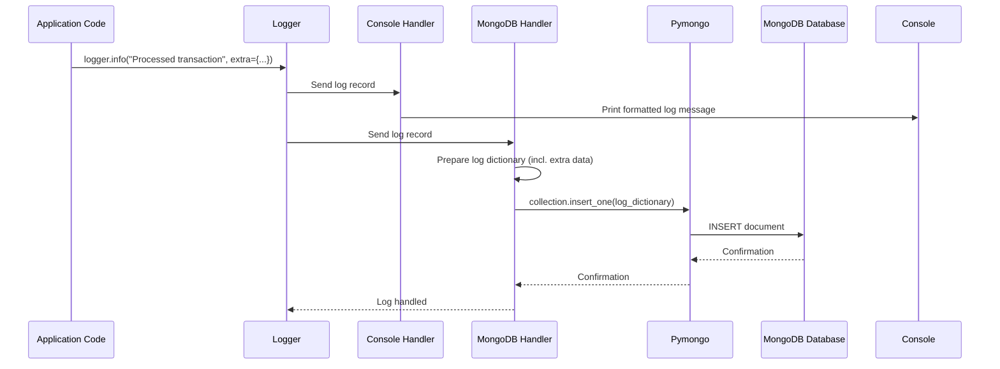

# Chapter 10: Logging System

Welcome back for the final chapter of the Big Defend IA tutorial! In the last chapter, [Real-time Data Flow (WebSockets)](09_real_time_data_flow__websockets__.md), we saw how the application can instantly push important updates, like new fraud alerts, to the Frontend user interface. This is great for keeping users informed in the moment.

But what about everything else that happens? What if an error occurs that stops a request? What if we want to see *exactly* when a specific user logged in, or track the fraud score for every single transaction processed, not just the ones that triggered an alert? What if we need to debug a tricky problem?

Just having real-time updates on the screen isn't enough for monitoring, auditing, and troubleshooting the system. We need a detailed history of events.

This is where the **Logging System** comes in.

### What is the Logging System?

Imagine Big Defend IA isn't just a bank security system, but also has a meticulous historian taking notes. This historian writes down everything important that happens: when someone tries to log in (success or failure), when a transaction is processed, what the AI's score was, when an alert is created, and especially when something unexpected goes wrong (an error).

The **Logging System** is like that historian writing everything into a persistent notebook (our database!). It's a dedicated part of the application whose job is to:

1.  **Record events:** Capture information about what the application is doing at specific points.
2.  **Categorize events:** Note how important each event is (e.g., just information, a warning, a critical error).
3.  **Store events:** Save these records reliably so they can be reviewed later, even long after the application has run.

It provides a trail of breadcrumbs that developers and administrators can follow to understand the application's behavior, diagnose issues, and audit activity.

### Our Use Case: Recording Application Events and Errors

Our core use case is simple but fundamental: **The application should automatically record important events (like processing a transaction) and any errors that occur, saving them for later review.**

How does Big Defend IA capture and store this historical information?

### Key Concepts: Levels, Loggers, Handlers, and Storage

The logging system in our Python Backend is built using Python's standard `logging` library, enhanced to send logs to a database. Here are the key ideas:

1.  **Logging Levels:** Not all messages are equally important. We categorize them using levels:

    | Level    | Description                                   | When to use it                                     |
    | :------- | :-------------------------------------------- | :------------------------------------------------- |
    | `DEBUG`  | Detailed information, useful for diagnosis. | Only during development or focused troubleshooting. |
    | `INFO`   | Confirmation that things are working as expected. | Normal operations (e.g., "User logged in", "Transaction processed"). |
    | `WARNING`| Something unexpected happened, but the application can continue. | Potentially problematic but not a failure (e.g., "Login attempt failed for user X"). |
    | `ERROR`  | A problem occurred that prevented an action. | When a specific task failed (e.g., "Failed to save transaction"). |
    | `CRITICAL`| A serious error, likely causing the application to stop or malfunction. | Very rare, indicates a major issue.             |

    In Big Defend IA, we generally log at `INFO` level and above, meaning `DEBUG` messages are usually ignored unless configured otherwise.

2.  **Logger:** This is the main object you interact with in your code. You get a `Logger` instance and call methods on it like `logger.info()`, `logger.error()`, etc., to send a log message.

3.  **Handlers:** A `Logger` doesn't save messages itself; it passes them to **Handlers**. Handlers are responsible for deciding *where* the log message should go and *what to do with it*. A logger can have multiple handlers. In our project, we have:
    *   A handler to print logs to the **console** (so developers see them when running the app).
    *   A custom handler to send logs to **MongoDB**.

4.  **Formatter:** Handlers often use a **Formatter** to define the structure and content of the log message (e.g., including the timestamp, level, and the message itself).

5.  **MongoDB Storage:** Our specific logging setup sends logs to a **MongoDB** database. As discussed in [Database Management](08_database_management_.md), MongoDB is flexible and well-suited for storing log entries which might vary slightly in structure or contain arbitrary details.

### How to Use the Logging System (Sending a Log Message)

Using the logging system is straightforward in Big Defend IA once it's set up.

1.  **Get the Logger:** You first need to get the main logger instance. The project provides a central logger initialized in `app/logging/log_setup.py`. You simply import this already-configured `logger` object into any Python file where you want to log.

    ```python
    # --- File: Any backend file, e.g., app/routers/transaction.py (Snippet) ---
    from fastapi import APIRouter, Depends # ... other imports ...
    # Import the configured logger
    from app.logging.log_setup import logger 
    # ... other imports ...

    router = APIRouter(...)

    @router.post("/add", response_model=TransactionRead)
    async def add_transaction(
        transaction: TransactionCreate,
        db: Session = Depends(get_db),
        # ... other dependencies ...
    ):
        # ... (Predict fraud, save transaction & alert logic) ...

        try:
            # ... (database save operations) ...

            if is_fraud:
                 # Log that an alert was created (INFO level)
                 logger.info(f"Alert created for transaction {new_transaction.id}", 
                             extra={ # Add extra context to the log entry
                                 "category": "alert", 
                                 "transaction_id": new_transaction.id,
                                 "fraud_probability": fraud_score,
                             })

            # Log successful transaction processing (INFO level)
            logger.info(f"Transaction {new_transaction.id} processed successfully for bank {new_transaction.banque_id}",
                        extra={
                            "category": "transaction",
                            "transaction_id": new_transaction.id,
                            "bank_id": new_transaction.banque_id,
                            "is_fraud": is_fraud,
                        })

            # ... (WebSocket send logic) ...

            return new_transaction

        except Exception as e:
            # Log any errors that occur (ERROR level)
            logger.error(f"Error processing transaction: {e}", 
                         exc_info=True, # Include traceback in log
                         extra={
                             "category": "error",
                             "details": {"original_error": str(e), "transaction_data": transaction.dict()},
                         })
            # Re-raise the exception so FastAPI handles it
            raise HTTPException(status_code=500, detail="Internal Server Error")
    ```

**Explanation:**

*   `from app.logging.log_setup import logger`: This line brings the pre-configured logger object into your file.
*   `logger.info(...)`: Calls the `info` method on the logger. This sends a message with `INFO` severity.
*   `logger.error(...)`: Calls the `error` method. This sends a message with `ERROR` severity.
*   `f"Message string"`: Standard Python f-strings are used to include variable values in the message text.
*   `extra={...}`: This is a powerful feature! The `extra` dictionary allows you to attach additional, structured data (like category, IDs, details) to a specific log entry. This data will be saved in MongoDB, making it much easier to filter and search logs later.
*   `exc_info=True`: When logging an error, setting `exc_info=True` tells the logging system to automatically include information about the current exception (the traceback) in the log entry, which is invaluable for debugging.

By adding these simple lines (`logger.info`, `logger.error`, etc.) at key points in the code, we create a detailed record of the application's execution flow and any issues encountered.

### How the Logging System Works (Under the Hood)

The power of Python's `logging` library comes from its modular design (Loggers -> Handlers -> Formatters). Let's see how Big Defend IA sets this up.

1.  **Logger Setup (`app/logging/log_setup.py`):** This file is responsible for creating and configuring the main logger instance used throughout the application.

    ```python
    # --- File: bdia-BackEND/app/logging/log_setup.py ---
    import logging
    from app.logging.mongodb_logger import MongoDBHandler # Import our custom handler

    def setup_logging():
        # Get or create a logger instance with a specific name
        logger = logging.getLogger("big_defend_ai")
        # Set the minimum level for messages to be processed
        logger.setLevel(logging.INFO) 

        # --- Console Handler ---
        console_handler = logging.StreamHandler() # Sends logs to console (stdout/stderr)
        console_handler.setLevel(logging.INFO) # Only handle INFO and above for console
        # Define how the message should look in the console
        formatter = logging.Formatter("%(asctime)s - %(levelname)s - %(message)s")
        console_handler.setFormatter(formatter)

        # --- MongoDB Handler ---
        # Our custom handler that sends logs to MongoDB
        mongo_handler = MongoDBHandler() 
        mongo_handler.setLevel(logging.INFO) # Only handle INFO and above for MongoDB

        # Add the handlers to the logger
        logger.addHandler(console_handler)
        # Only add mongo handler if collection is initialized (mongo connection succeeded)
        if mongo_handler.collection is not None:
             logger.addHandler(mongo_handler)
             print("✅ MongoDB logging handler added.")
        else:
             print("❌ MongoDB logging handler NOT added (connection failed).")


        return logger

    # Call the setup function when this module is imported
    logger = setup_logging() 
    ```
    This code defines `setup_logging` which creates the `logger` and attaches two handlers: one for the console and one for MongoDB (using our custom `MongoDBHandler`). It sets the overall minimum level to `INFO`. The `logger = setup_logging()` line ensures this configuration runs once when the application starts and imports this file.

2.  **MongoDB Handler (`app/logging/mongodb_logger.py`):** This is the custom handler that bridges Python's logging and our MongoDB database.

    ```python
    # --- File: bdia-BackEND/app/logging/mongodb_logger.py ---
    import logging
    from datetime import datetime
    # Import the pre-initialized MongoDB collection object
    from app.logging.mongo_connection import collection 

    class MongoDBHandler(logging.Handler):
        def __init__(self):
            super().__init__()
            # Check if the MongoDB connection was successful
            if collection is None:
                # If not, raise an error or handle appropriately
                # (The setup_logging will check this and not add the handler if it fails)
                pass # Allow handler creation even if collection is None, check in emit
            self.collection = collection

        def emit(self, record):
            # This method is called by the logger for each message it processes
            if self.collection is None:
                 # Don't try to log if connection failed
                 print("MongoDB handler: Collection is None, skipping log.")
                 return

            # --- Prepare the log data as a Python dictionary ---
            log_entry = {
                "timestamp": datetime.utcnow().isoformat(), # Add current time
                "level": record.levelname, # Add log level (INFO, ERROR, etc.)
                "message": self.format(record), # Format the message text

                # --- Include extra data passed via logger.info(..., extra={...}) ---
                "category": getattr(record, "category", "general"), 
                "user_id": getattr(record, "user_id", None),
                "bank_id": getattr(record, "bank_id", None),
                "transaction_id": getattr(record, "transaction_id", None),
                "details": getattr(record, "details", {}),
                # --- End extra data ---

                # Add exception info if available (from exc_info=True)
                "exc_info": self.formatException(record.exc_info) if record.exc_info else None,
            }
            # --- End preparing data ---

            # --- Use Pymongo to save the dictionary to MongoDB ---
            try:
                self.collection.insert_one(log_entry) # Insert as a new document
            except Exception as e:
                # If saving to MongoDB fails, print an error to the console
                # so we know logging itself is having problems.
                print(f"[CRITICAL ERROR] Failed to insert log in MongoDB: {e}") 
            # --- End saving ---

    ```

    **Explanation:**

    *   `class MongoDBHandler(logging.Handler)`: This defines a class that inherits from Python's base logging handler.
    *   `__init__`: Stores the MongoDB collection object.
    *   `emit(self, record)`: This is the core method. It receives a `record` object containing all the information about the log message (level, message text, timestamp, and crucially, the `extra` dictionary).
    *   `log_entry = { ... }`: It constructs a Python dictionary. The keys are what will become fields in the MongoDB document. Standard fields like `timestamp`, `level`, and `message` are included. It uses `getattr(record, "fieldName", defaultValue)` to safely get the values from the `extra` dictionary we passed (like `category`, `user_id`, etc.). If `extra` wasn't provided or didn't have a field, it uses the `defaultValue`.
    *   `self.collection.insert_one(log_entry)`: This command, using the Pymongo library, takes the Python dictionary `log_entry` and saves it as a new document in the MongoDB collection.
    *   The `try...except` around `insert_one` is important; it prevents the application from crashing if there's a problem saving the log itself (e.g., MongoDB is down). It prints a critical error *to the console* instead.

3.  **MongoDB Connection (`app/logging/mongo_connection.py`):** This file establishes the connection to the MongoDB server using Pymongo, similar to how we connected to PostgreSQL with SQLAlchemy in [Database Management](08_database_management_.md).

    ```python
    # --- File: bdia-BackEND/app/logging/mongo_connection.py ---
    import os
    from pymongo import MongoClient # The Python driver for MongoDB
    from dotenv import load_dotenv

    load_dotenv() # Load variables from .env file
    # Get connection details from environment variables (set in .env or docker-compose)
    MONGO_URL = os.getenv("MONGODB_URI", "mongodb://localhost:27017") 
    MONGO_DB_NAME = os.getenv("MONGODB_DB", "bigdefend_logs")
    MONGO_COLLECTION_NAME = os.getenv("MONGO_COLLECTION_NAME", "logs")

    client = None # Will hold the connection client
    collection = None # Will hold the collection object

    def init_mongo():
        global client, collection # Declare we're using global variables
        try:
            # --- Connect to MongoDB server ---
            client = MongoClient(MONGO_URL, serverSelectionTimeoutMS=5000) # Connect, wait max 5s
            client.admin.command('ping') # Send a command to verify connection
            # --- Select the database and collection ---
            db = client[MONGO_DB_NAME] 
            collection = db[MONGO_COLLECTION_NAME]
            print(f"✅ MongoDB connected to {MONGO_URL}, database: {MONGO_DB_NAME}, collection: {MONGO_COLLECTION_NAME}")
        except Exception as e:
            print(f"❌ MongoDB connection failed: {e}")
            collection = None # Set collection to None if connection fails

    # Call the connection function when this file is imported (during app startup)
    init_mongo()
    ```
    This file sets up the connection credentials (from `.env` or Docker config), uses `pymongo.MongoClient` to connect to the server, selects the database and collection, and stores the `collection` object in a global variable. `init_mongo()` is called when the module is imported, attempting to connect at application start. The `MongoDBHandler` relies on this `collection` object being successfully initialized.

### The Logging Flow

Here's a simple diagram showing the path of a log message:



This shows that when you call a logging method like `logger.info`, the message goes to the central `Logger`, which then passes it to *all* configured `Handlers` (Console and MongoDB). Each handler processes the message independently.

### Viewing the Logs

Once logs are saved in MongoDB, how do you see them?

*   **Console Logs:** Messages sent to the `Console Handler` appear directly in the terminal window where you run the Backend application. This is useful for real-time monitoring during development.
*   **MongoDB Logs:** These logs are stored persistently in the database. You can access them using:
    *   **MongoDB Command Line Interface (CLI):** Advanced users can connect directly to MongoDB and query the `logs` collection using commands.
    *   **MongoDB GUI Tools:** Tools like MongoDB Compass or the `mongo-express` web interface (included in the `docker-compose.yml` as seen in [Database Management](08_database_management_.md)) provide a user-friendly way to browse, filter, and search the documents in the `logs` collection. This is often the easiest way for beginners to see the logs saved in the database.

Using `mongo-express` (accessible via `http://localhost:8081` when running with Docker Compose) allows you to see the structured log entries saved by the `MongoDBHandler`, including the `level`, `message`, `timestamp`, and any `extra` fields like `category`, `user_id`, or `transaction_id` that you added.

### Conclusion

The **Logging System** is like the application's memory and event recorder. By using Python's flexible `logging` library with custom handlers that save messages to **MongoDB**, Big Defend IA ensures that important application events, fraud detection results, user actions, and errors are captured and stored persistently. This provides developers and administrators with invaluable information for monitoring the system's health, diagnosing issues, auditing past activities, and understanding exactly what happened and when.

This chapter concludes our introductory tutorial into the core components of the Big Defend IA project. We've journeyed from the communication hub and security layers through the AI intelligence, data handling, real-time updates, and finally, the system's crucial memory. Understanding these foundational pieces should provide a solid starting point for exploring the codebase further or contributing to the project.