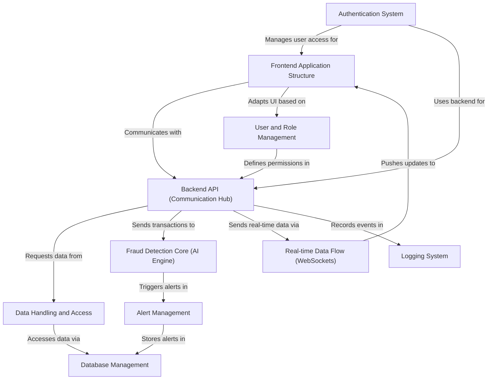

# Tutorial: Big_defend_IA

BigDefend AI is a **fraud detection system** designed to analyze transactions using AI.
It features a **frontend dashboard** for different user roles (admin, analyst, client) to monitor transactions and fraud alerts in **real-time**.
A **backend API** handles data processing, communication with the **database**, runs the **AI fraud detection models**, and manages user access and alerts.
Data is handled carefully, using mock data for development and real data from a database in production, with a **logging system** to track events.

## Visual Overview

## Chapters

1. [Backend API (Communication Hub)
](01_backend_api__communication_hub__.md)
2. [Authentication System
](02_authentication_system_.md)
3. [User and Role Management
](03_user_and_role_management_.md)
4. [Frontend Application Structure
](04_frontend_application_structure_.md)
5. [Fraud Detection Core (AI Engine)
](05_fraud_detection_core__ai_engine__.md)
6. [Alert Management
](06_alert_management_.md)
7. [Data Handling and Access
](07_data_handling_and_access_.md)
8. [Database Management
](08_database_management_.md)
9. [Real-time Data Flow (WebSockets)
](09_real_time_data_flow__websockets__.md)
10. [Logging System
](10_logging_system_.md)